---
## Author
author:
  name: Головко Екатерина Андреевна
  degrees: DSc
  orcid: 0000-0002-0877-7063
  email: 1032252356@rudn.ru
  affiliation:
    - name: Российский университет дружбы народов
      country: Российская Федерация
      postal-code: 117198
      city: Москва
      address: ул. Миклухо-Маклая, д. 6
## Title
title: Презентация по лабораторной работе №1
subtitle: Операционные системы 
license: CC BY
date: today
date-format: "YYYY-MM-DD" # Example: 2025-09-06
---

# Информация

## Докладчик

:::::::::::::: {.columns align=center}
::: {.column width="70%"}

  * Головко Екатерина Андреевна
  * студент
  * студент ФФМиЕН НБИ
  * Российский университет дружбы народов им. П. Лумумбы
  * [1032252356@rudn.ru](mailto:1032252356@rudn.ru)

:::
::: {.column width="30%"}

:::
::::::::::::::

# Вводная часть

## Цель работы 

- научиться устанавливать ОС
- настраивать ОС для дальнейшей работы

## Задание

- установка ОС на ВМ
- действия после установки
- установка программного обеспечения
- домашнее задание

# Установка операционной системы

## Установка операционной системы

- Устанавливаю имя виртуальной машины и выбираю образ ([рис. @fig-001]).

{#fig-001 width=70%}

## Установка операционной системы

- Указываю виртуальное оборудование ([рис. @fig-002]).

{#fig-002 width=70%}

## Установка операционной системы

- Указываю виртуальный жесткий диск ([рис. @fig-003]).

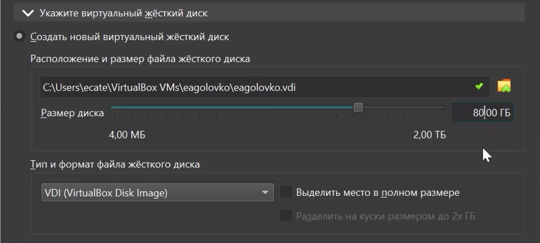{#fig-003 width=70%}

## Установка операционной системы

- Запускаю терминал и ввожу команду liveinst ([рис. @fig-004]).

{#fig-004 width=70%}

## Установка операционной системы

- Настраиваю и выполняю загрузку  ([рис. @fig-005]).

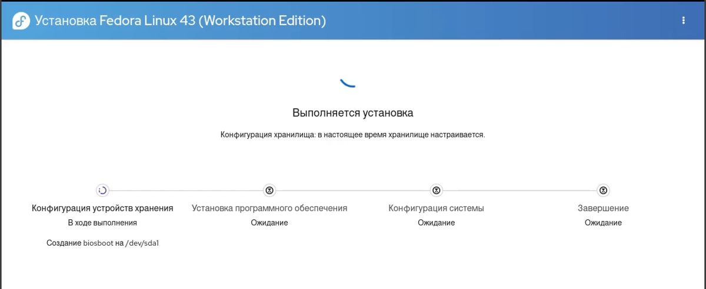{#fig-005 width=70%}

## Установка операционной системы

- После установки выключаю виртуальную машину, захожу в носители и изымаю диск ([рис. @fig-006]).

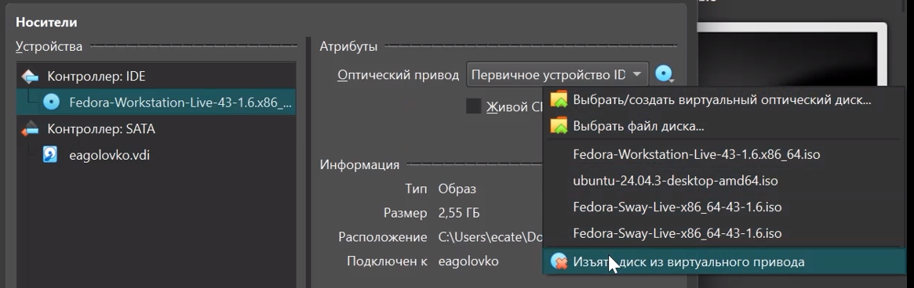{#fig-006 width=70%}

# Действия после установки

## Действия после установки

Устанавливаю средства разработки ([рис. @fig-008]).

{#fig-008 width=70%}

## Действия после установки

Обновляю все пакеты ([рис. @fig-009]).

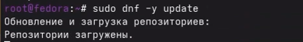{#fig-009 width=70%}

## Действия после установки

Устанавливаю программу для удобства работы в консоли ([рис. @fig-010]).

{#fig-010 width=70%}

## Действия после установки

Установка программного обеспечения для автоматического обновления ([рис. @fig-011]).

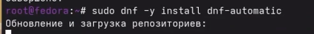{#fig-011 width=70%}

## Действия после установки

Перехожу в файл /etc/selinux/config c помощью команды mc ([рис. @fig-013]).

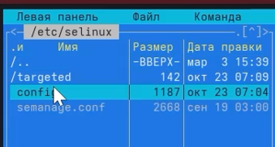{#fig-013 width=70%}

## Действия после установки

Заменяю значение SELINUX=enforcing на SELINUX=permissive ([рис. @fig-014]).

{#fig-014 width=70%}

# Установка программного обеспечения

## Установка программного обеспечения

Устанавливаю дистрибутив TeXlive ([рис. @fig-016]).

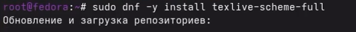{#fig-016 width=70%}

# Домашнее задание

## Домашнее задание

1. Узнаю версию ядра Linux ([рис. @fig-017]).

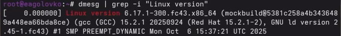{#fig-017 width=70%}

## Домашнее задание

2. Узнаю частоту процессора ([рис. @fig-018]).

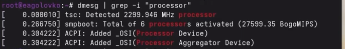{#fig-018 width=70%}

## Домашнее задание

3. Узнаю модель процессора ([рис. @fig-019]).

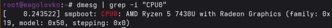{#fig-019 width=70%}

## Домашнее задание

4. Узнаю объем доступной оперативной памяти ([рис. @fig-020]).

{#fig-020 width=70%}

## Домашнее задание

5. Узнаю тип обнаруженного гипервизора ([рис. @fig-021]).

{#fig-021 width=70%}

## Домашнее задание

6. Узнаю тип файловой корневой системы ([рис. @fig-022]).

{#fig-022 width=70%}

## Домашнее задание

7. Узнаю последовательность монтирования файловых систем ([рис. @fig-023]).

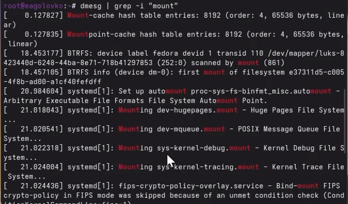{#fig-023 width=70%}

# Вывод

## Вывод

- В ходе выполнения данной лабораторной работы я приобрела навыки установки ОС на ВМ настройки минимально необходимых для дальнейшей работы сервисов.