---
## Author
author:
  name: Головко Екатерина Андреевна
  degrees: DSc
  orcid: 0000-0002-0877-7063
  email: 1032252356@rudn.ru
  affiliation:
    - name: Российский университет дружбы народов
      country: Российская Федерация
      postal-code: 117198
      city: Москва
      address: ул. Миклухо-Маклая, д. 6

## Title
title: "Отчет по выполнению лабораторной работы №1"
subtitle: "Операционные системы"
license: "CC BY"
---

# Цель работы

Целью данной работы является приобретение практических навыков установки операционной системы на виртуальную машину, настройки минимально необходимых для дальнейшей работы сервисов.

# Задание

1. Установка операционной системы
2. Действия после установки
3. Установка программного обеспечения
4. Домашнее задание

# Выполнение лабораторной работы

## Установка операционной системы

Устанавливаю имя виртуальной машины и выбираю образ ([рис. @fig-001]).

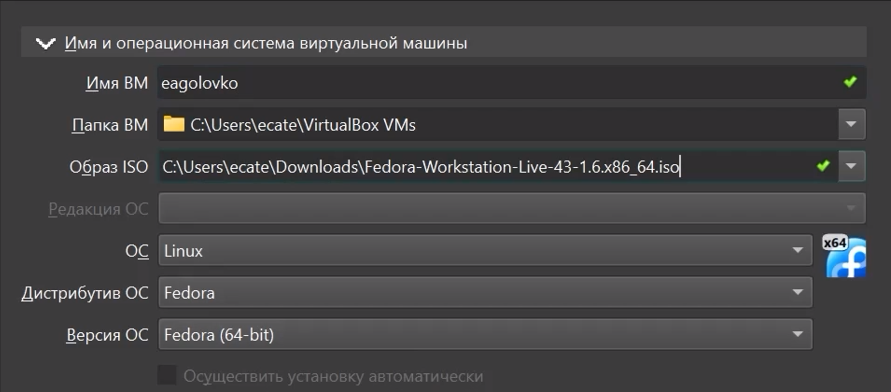{#fig-001 width=70%}

Указываю виртуальное оборудование ([рис. @fig-002]).

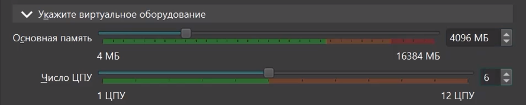{#fig-002 width=70%}

Указываю виртуальный жесткий диск ([рис. @fig-003]).

{#fig-003 width=70%}

Запускаю терминал и ввожу команду liveinst ([рис. @fig-004]).

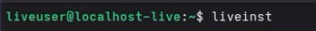{#fig-004 width=70%}

Настраиваю и выполняю загрузку  ([рис. @fig-005]).

{#fig-005 width=70%}

После установки выключаю виртуальную машину, захожу в носители и изымаю диск ([рис. @fig-006]).

{#fig-006 width=70%}

Затем перезапускаю, выбираю часовой пояс, указываю имя пользователя и пароль для входа.

## Действия после установки

Затем переключаюсь на суперпользователя ([рис. @fig-007]).

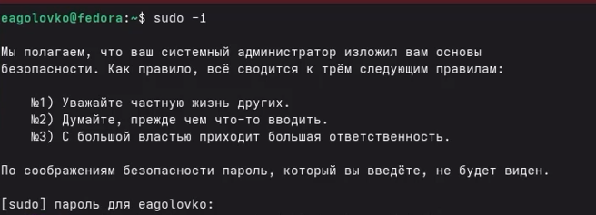{#fig-007 width=70%}

Устанавливаю средства разработки ([рис. @fig-008]).

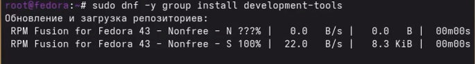{#fig-008 width=70%}

Обновляю все пакеты ([рис. @fig-009]).

{#fig-009 width=70%}

Устанавливаю программу для удобства работы в консоли ([рис. @fig-010]).

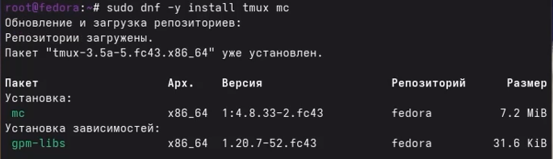{#fig-010 width=70%}

Установка программного обеспечения для автоматического обновления ([рис. @fig-011]).

{#fig-011 width=70%}

Задаю необходимую конфигурацию и запускаю таймер ([рис. @fig-012]).

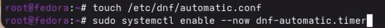{#fig-012 width=70%}

Перехожу в файл /etc/selinux/config c помощью команды mc ([рис. @fig-013]).

{#fig-013 width=70%}

Заменяю значение SELINUX=enforcing на SELINUX=permissive ([рис. @fig-014]).

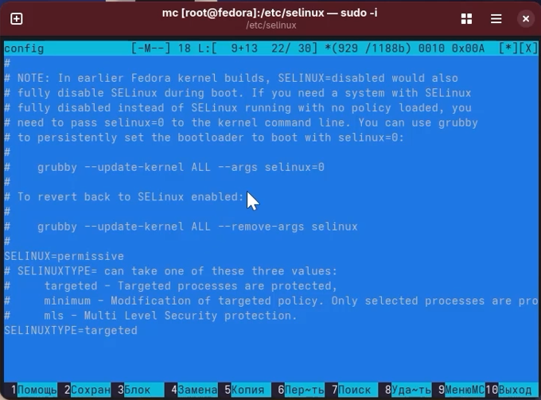{#fig-014 width=70%}

Затем перезапускаю систему ([рис. @fig-015]).

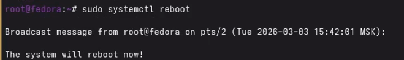{#fig-015 width=70%}

## Установка программного обеспечения

Устанавливаю pandoc и pandoc-crossref вручную, используя ссылки на репозитории в гитхаб.

Устанавливаю дистрибутив TeXlive ([рис. @fig-016]).

{#fig-016 width=70%}

## Домашнее задание
1. Узнаю версию ядра Linux ([рис. @fig-017]).

{#fig-017 width=70%}

2. Узнаю частоту процессора ([рис. @fig-018]).

{#fig-018 width=70%}

3. Узнаю модель процессора ([рис. @fig-019]).

{#fig-019 width=70%}

4. Узнаю объем доступной оперативной памяти ([рис. @fig-020]).

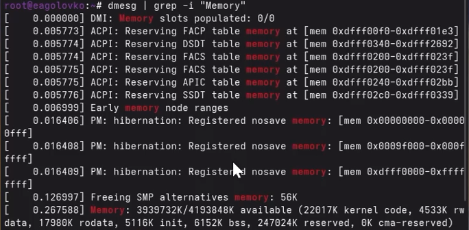{#fig-020 width=70%}

5. Узнаю тип обнаруженного гипервизора ([рис. @fig-021]).

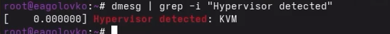{#fig-021 width=70%}

6. Узнаю тип файловой корневой системы ([рис. @fig-022]).

{#fig-022 width=70%}

7. Узнаю последовательность монтирования файловых систем ([рис. @fig-023]).

{#fig-023 width=70%}

# Выводы

В ходе выполнения данной лабораторной работы я приобрела навыки установки ОС на ВМ настройки минимально необходимых для дальнейшей работы сервисов.

