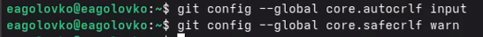
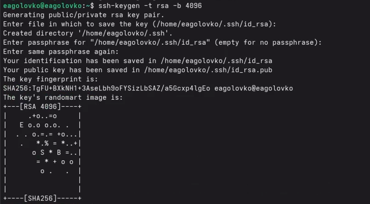
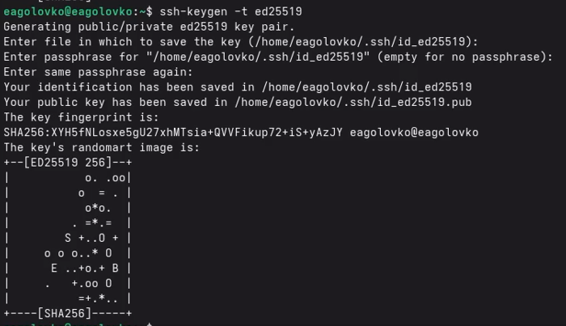
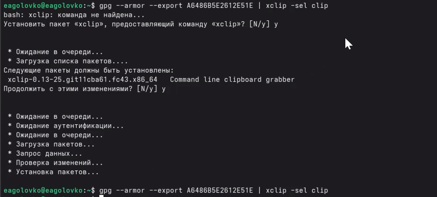
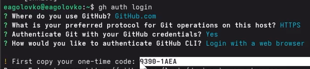
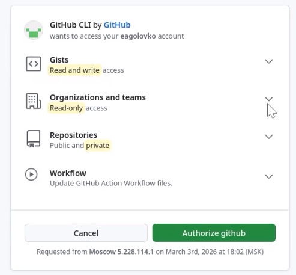
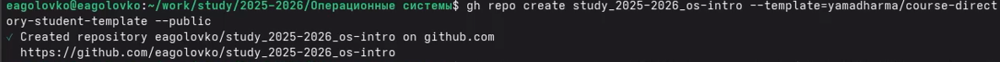
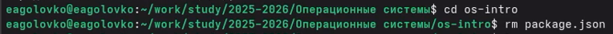
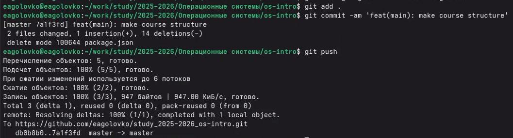

---
## Author
author:
  name: Головко Екатерина Андреевна
  degrees: DSc
  orcid: 0000-0002-0877-7063
  email: 1032252356@rudn.ru
  affiliation:
    - name: Российский университет дружбы народов
      country: Российская Федерация
      postal-code: 117198
      city: Москва
      address: ул. Миклухо-Маклая, д. 6
## Title
title: Презентация по лабораторной работе №2
subtitle: Операционные системы
license: CC BY
date: today
date-format: "YYYY-MM-DD" # Example: 2025-09-06
---

# Информация

## Докладчик

:::::::::::::: {.columns align=center}
::: {.column width="70%"}

  * Головко Екатерина Андреевна
  * студент
  * студент ФФМиЕН НБИ
  * Российский университет дружбы народов им. П. Лумумбы
  * [1032252356@rudn.ru](mailto:1032252356@rudn.ru)

:::
::: {.column width="30%"}

:::
::::::::::::::

## Цель работы

- Изучить идеологию и применение средств контроля версий и освоить умения по работе с git.

## Задание

- Установка программного обеспечения
- Базовая настройка git
- Создайте ключи ssh
- Создайте ключи pgp
- Настройка github
- Добавление PGP ключа в GitHub
- Настройка автоматических подписей коммитов git
- Настройка gh
- Настройка рабочего пространства и репозитория

# Выполнение лабораторной работы

## Установка программного обеспечения

Устанавливаю git и gh ([рис. @fig-001],[рис. @fig-002] ).

{#fig-001 width=70%}

{#fig-002 width=70%}

## Базовая настройка git

Задаю имя и почту владельца репозитория ([рис. @fig-003]).

{#fig-003 width=70%}

## Базовая настройка git

Настроиваю utf-8 в выводе сообщений git ([рис. @fig-004]).

{#fig-004 width=70%}

## Базовая настройка git

Задаю имя начальной ветки ([рис. @fig-005]).

{#fig-005 width=70%}

## Базовая настройка git

Задаю параметр autocrlf ([рис. @fig-006]).

{#fig-006 width=70%}

## Создание ключа ssh

Создаю по алгоритму rsa с ключём размером 4096 бит ([рис. @fig-007]).

{#fig-007 width=70%}

## Создание ключа ssh

Создаю по алгоритму ed25519 ([рис. @fig-008]).

{#fig-008 width=70%}

## Создание ключа pgp

Создаю ключи pgp ([рис. @fig-009]).

{#fig-009 width=70%}

## Добавление PGP ключа в GitHub

Вывожу список ключей и копирую отпечаток приватного ключа ([рис. @fig-011]).

{#fig-011 width=70%}

## Добавление PGP ключа в GitHub

Копирую сгенерированный ключ в буфер обмена ([рис. @fig-012]).

{#fig-012 width=70%}

## Добавление PGP ключа в GitHub

Захожу на сайт githab, перехожу в настройки ключей и добавляю новый ключ ([рис. @fig-013]).

{#fig-013 width=70%}

## Настройка автоматических подписей коммитов git

Ввожу команды в терминал, чтобы гит применял указанную почту при создании коммитов ([рис. @fig-014]).

{#fig-014 width=70%}

## Настройка gh

Авторизовываюсь через терминал ([рис. @fig-014]).

{#fig-014 width=70%}

## Настройка gh

Затем завершаю настройку через браузер ([рис. @fig-015]).

{#fig-015 width=70%}

## Настройка рабочего пространства и репозитория

Создаю шаблон рабочего пространства ([рис. @fig-016], [рис. @fig-017], [рис. @fig-018]).

{#fig-016 width=70%}

{#fig-017 width=70%}

{#fig-018 width=70%}

## Настройка рабочего пространства и репозитория

Перехожу в каталог курса и удаляю лишние файлы ([рис. @fig-019]).

{#fig-019 width=70%}

## Настройка рабочего пространства и репозитория

Создаю необходимые каталоги ([рис. @fig-020]).

{#fig-020 width=70%}

##  Настройка рабочего пространства и репозитория

Отправляю файлы на сервер ([рис. @fig-021]).

{#fig-021 width=70%}

## Вывод

При выполнении данной лабораторной работы я изучила идеологию и применение средств контроля версий, освоила умение по работе с git.