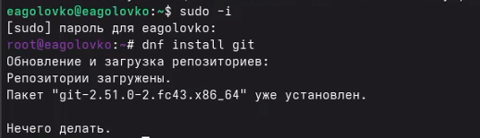
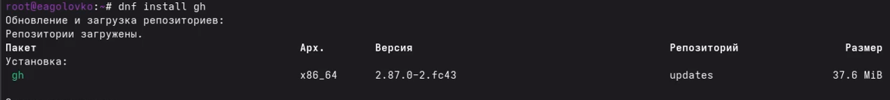
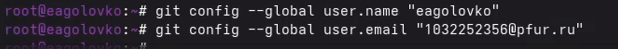
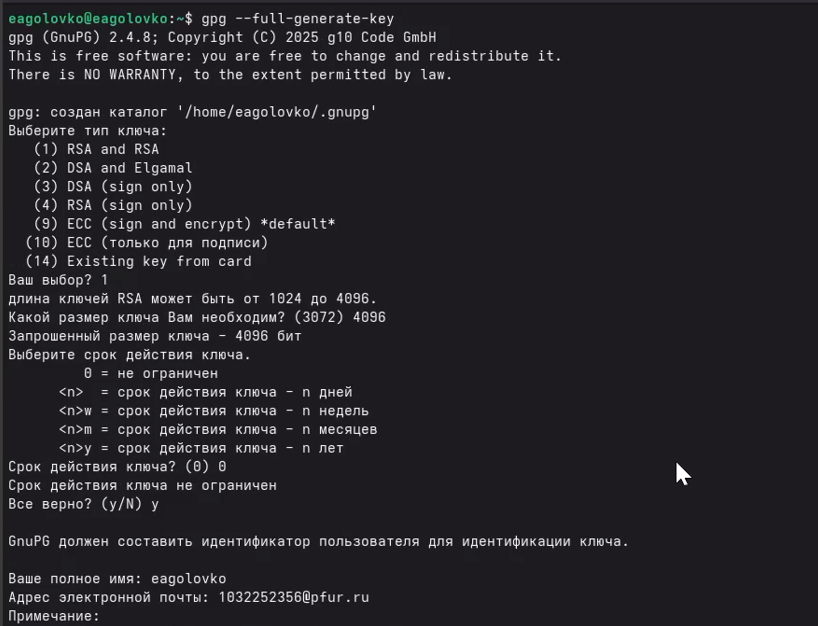
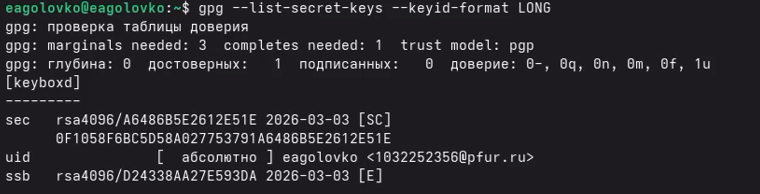
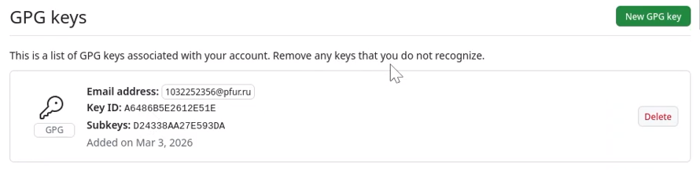
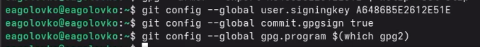
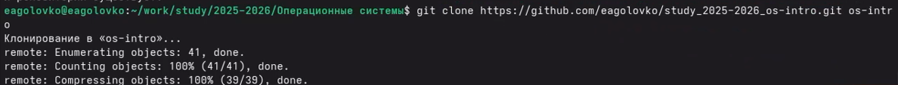

---
## Author
author:
  name: Головко Екатерина Андреевна
  degrees: DSc
  orcid: 0000-0002-0877-7063
  email: 1032252356@rudn.ru
  affiliation:
    - name: Российский университет дружбы народов
      country: Российская Федерация
      postal-code: 117198
      city: Москва
      address: ул. Миклухо-Маклая, д. 6

## Title
title: "Отчёт по выполнению лабораторной работы №2"
subtitle: "Операционные системы"
license: "CC BY"
---

# Цель работы

Изучить идеологию и применение средств контроля версий и освоить умения по работе с git.

# Задание

1.Установка программного обеспечения
2.Базовая настройка git
3.Создайте ключи ssh
4.Создайте ключи pgp
5.Настройка github
6.Добавление PGP ключа в GitHub
7.Настройка автоматических подписей коммитов git
8.Настройка gh
9.Настройка рабочего пространства и репозитория

# Теоретическое введение

Системы контроля версий (Version Control System, VCS) применяются при работе нескольких человек над одним проектом. Обычно основное дерево проекта хранится в локальном или удалённом репозитории, к которому настроен доступ для участников проекта. При внесении изменений в содержание проекта система контроля версий позволяет их фиксировать, совмещать изменения, произведённые разными участниками проекта, производить откат к любой более ранней версии проекта, если это требуется.
В классических системах контроля версий используется централизованная модель, предполагающая наличие единого репозитория для хранения файлов. Выполнение большинства функций по управлению версиями осуществляется специальным сервером. Участник проекта (пользователь) перед началом работы посредством определённых команд получает нужную ему версию файлов. После внесения изменений, пользователь размещает новую версию в хранилище. При этом предыдущие версии не удаляются из центрального хранилища и к ним можно вернуться в любой момент. Сервер может сохранять не полную версию изменённых файлов, а производить так называемую дельта-компрессию — сохранять только изменения между последовательными версиями, что позволяет уменьшить объём хранимых данных.
Системы контроля версий поддерживают возможность отслеживания и разрешения конфликтов, которые могут возникнуть при работе нескольких человек над одним файлом. Можно объединить (слить) изменения, сделанные разными участниками (автоматически или вручную), вручную выбрать нужную версию, отменить изменения вовсе или заблокировать файлы для изменения. В зависимости от настроек блокировка не позволяет другим пользователям получить рабочую копию или препятствует изменению рабочей копии файла средствами файловой системы ОС, обеспечивая таким образом, привилегированный доступ только одному пользователю, работающему с файлом.
Системы контроля версий также могут обеспечивать дополнительные, более гибкие функциональные возможности. Например, они могут поддерживать работу с несколькими версиями одного файла, сохраняя общую историю изменений до точки ветвления версий и собственные истории изменений каждой ветви. Кроме того, обычно доступна информация о том, кто из участников, когда и какие изменения вносил. Обычно такого рода информация хранится в журнале изменений, доступ к которому можно ограничить.
В отличие от классических, в распределённых системах контроля версий центральный репозиторий не является обязательным.
Среди классических VCS наиболее известны CVS, Subversion, а среди распределённых — Git, Bazaar, Mercurial. Принципы их работы схожи, отличаются они в основном синтаксисом используемых в работе команд.

# Выполнение лабораторной работы

## Установка программного обеспечения

Устанавливаю git и gh ([рис. @fig-001],[рис. @fig-002] ).

{#fig-001 width=70%}

{#fig-002 width=70%}

## Базовая настройка git

Задаю имя и почту владельца репозитория ([рис. @fig-003]).

{#fig-003 width=70%}

Настроиваю utf-8 в выводе сообщений git ([рис. @fig-004]).

{#fig-004 width=70%}

Задаю имя начальной ветки ([рис. @fig-005]).

{#fig-005 width=70%}

Задаю параметр autocrlf ([рис. @fig-006]).

{#fig-006 width=70%}

## Создайте ключи ssh

Создаю по алгоритму rsa с ключём размером 4096 бит ([рис. @fig-007]).

{#fig-007 width=70%}

Создаю по алгоритму ed25519 ([рис. @fig-008]).

{#fig-008 width=70%}

## Создайте ключи pgp

Создаю ключи pgp ([рис. @fig-009]).

{#fig-009 width=70%}

## Настройка github

Аккаунт на гитхаб был создан в прошлом семестре, поэтому не выполняю данный этап лабораторной работы.

## Добавление PGP ключа в GitHub

Вывожу список ключей и копирую отпечаток приватного ключа ([рис. @fig-011]).

{#fig-011 width=70%}

Копирую сгенерированный ключ в буфер обмена ([рис. @fig-012]).

{#fig-012 width=70%}

Захожу на сайт githab, перехожу в настройки ключей и добавляю новый ключ ([рис. @fig-013]).

{#fig-013 width=70%}

## Настройка автоматических подписей коммитов git

Ввожу команды в терминал, чтобы гит применял указанную почту при создании коммитов ([рис. @fig-014]).

{#fig-014 width=70%}

## Настройка gh

Авторизовываюсь через терминал ([рис. @fig-014]).

{#fig-014 width=70%}

Затем завершаю настройку через браузер ([рис. @fig-015]).

{#fig-015 width=70%}

## Настройка рабочего пространства и репозитория

Создаю шаблон рабочего пространства ([рис. @fig-016], [рис. @fig-017], [рис. @fig-018]).

{#fig-016 width=70%}

{#fig-017 width=70%}

{#fig-018 width=70%}

Перехожу в каталог курса и удаляю лишние файлы ([рис. @fig-019]).

{#fig-019 width=70%}

Создаю необходимые каталоги ([рис. @fig-020]).

{#fig-020 width=70%}

Отправляю файлы на сервер ([рис. @fig-021]).

{#fig-021 width=70%}

# Выводы

При выполнении данной лабораторной работы я изучила идеологию и применение средств контроля версий, освоила умение по работе с git.

