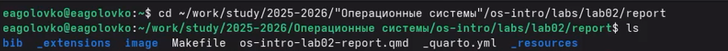
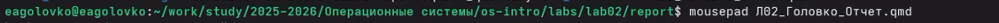
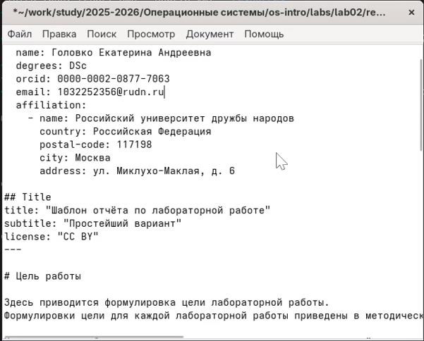
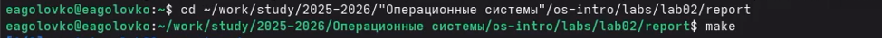
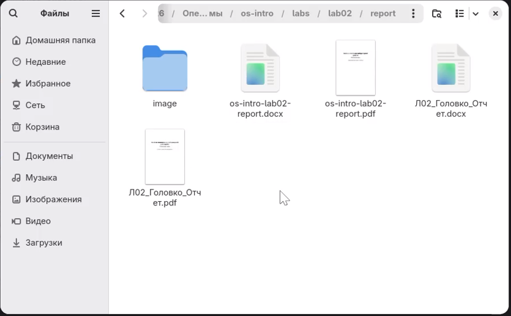
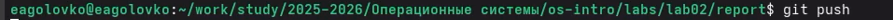
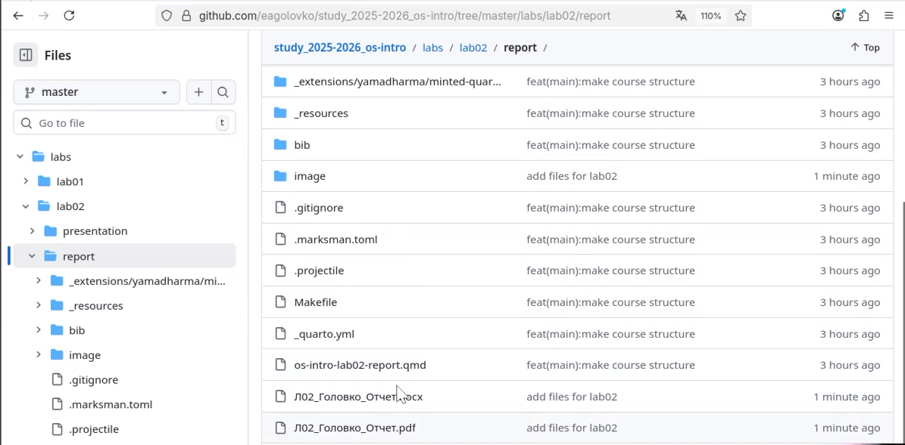

---
## Author
author:
  name: Головко Екатерина Андреевна
  degrees: DSc
  orcid: 0000-0002-0877-7063
  email: 1032252356@rudn.ru
  affiliation:
    - name: Российский университет дружбы народов
      country: Российская Федерация
      postal-code: 117198
      city: Москва
      address: ул. Миклухо-Маклая, д. 6
## Title
title: Презентация по лабораторной работе №3
subtitle: Операционные системы
license: CC BY
date: today
date-format: "YYYY-MM-DD" # Example: 2025-09-06
---

## Докладчик

:::::::::::::: {.columns align=center}
::: {.column width="70%"}

  * Головко Екатерина Андреевна
  * студент
  * студент ФФМиЕН НБИ
  * Российский университет дружбы народов им. П. Лумумбы
  * [1032252356@rudn.ru](mailto:k1032252356@rudn.ru)

:::
::: {.column width="30%"}

:::
::::::::::::::

## Цель работы

Целью данной лабораторной работы является приобретение навыков работы с легковесным языком разметки Markdown.

## Задание

1. Выполнить отчет по лабораторной работе №2.
2. Выгрузить файлы на GitHub.

## Выполнение отчета по лабораторной работе №2

Перехожу в каталог, где находится шаблон отчета ([рис. @fig-001]).

{#fig-001 width=70%}

## Выполнение отчета по лабораторной работе №2

Копирую шаблон с новым нужным для меня названием ([рис. @fig-002]).

{#fig-002 width=70%}

## Выполнение отчета по лабораторной работе №2

Открываю созданный файл с помощью текстового редактора mousepad ([рис. @fig-003]).

{#fig-003 width=70%}

## Выполнение отчета по лабораторной работе №2

Примеры редакции файла ([рис. @fig-004], [рис. @fig-005]).

{#fig-004 width=70%}

{#fig-005 width=70%}

## Выполнение отчета по лабораторной работе №2

Компилирую файл (вывод будет в двух форматах pdf и docx) ([рис. @fig-006]).

{#fig-006 width=70%}

## Выполнение отчета по лабораторной работе №2

Проверяю в файлах в каталоге _output все ли создалось верно ([рис. @fig-007]).

{#fig-007 width=70%}

## Выгрузка файлов в GitHub

Выгружаю файлы ([рис. @fig-008], [рис. @fig-009]).

{#fig-008 width=70%}

{#fig-009 width=70%}

## Выгрузка файлов в GitHub

Проверяю в GitHub все ли выгрузилось так, как мне нужно ([рис. @fig-010]).

{#fig-010 width=70%}

# Вывод

## Вывод

В ходе данной лабораторной работы я приобрела навыки работы с легковесным языком разметки Markdown.
