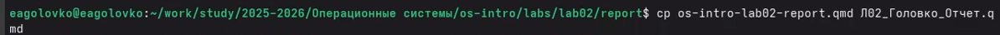
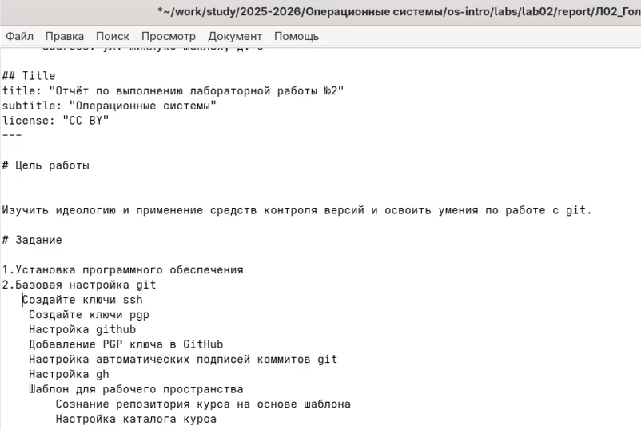
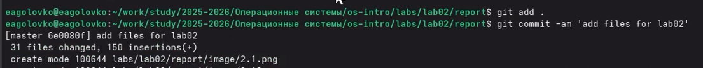

---
## Author
author:
  name: Головко Екатерина Андреевна
  degrees: DSc
  orcid: 0000-0002-0877-7063
  email: 1032252356@rudn.ru
  affiliation:
    - name: Российский университет дружбы народов
      country: Российская Федерация
      postal-code: 117198
      city: Москва
      address: ул. Миклухо-Маклая, д. 6

## Title
title: "Отчет по выполнению лабораторной работы №3"
subtitle: "Операционные системы"
license: "CC BY"
---

# Цель работы

Целью данной лабораторной работы является приобретение навыков работы с легковесным языком разметки Markdown.

# Задание

1. Выполнить отчет по лабораторной работе №2.
2. Выгрузить файлы на GitHub.

# Теоретическое введение

## Оформление отчета по лабораторной работе
Лабораторная работа является небольшой научно-исследовательской работой, которую
и оформлять следует по всем утверждённым требованиям. При подготовке отчета по ла-
бораторной работе вы освоите ряд важных элементов, которые в дальнейшем пригодятся
вам при написании курсовой и дипломной работы.
## Структура отчёта
Согласно ГОСТ 7.32-2001, любая научно-исследовательская работа должна обязательно
содержать следующие элементы:
– титульный лист;
– реферат;
– введение;
– основную часть;
– заключение.
Также ГОСТ рекомендует включить в работу и такие элементы:
– список исполнителей;
– содержание;
– нормативные ссылки;
– определения;
– обозначения и сокращения;
– список использованных источников;
– приложения.
Если вы проводите сложную работу, выполняемую в несколько этапов, то вам может
понадобиться включить в работу часть или все элементы второго списка

# Выполнение лабораторной работы

## Выполнить отчет по лабораторной работе №2

Перехожу в каталог, где находится шаблон отчета ([рис. @fig-001]).

{#fig-001 width=70%}

Копирую шаблон с новым нужным для меня названием ([рис. @fig-002]).

{#fig-002 width=70%}

Открываю созданный файл с помощью текстового редактора mousepad ([рис. @fig-003]).

{#fig-003 width=70%}

Примеры редакции файла ([рис. @fig-004], [рис. @fig-005]).

{#fig-004 width=70%}

{#fig-005 width=70%}

Компилирую файл (вывод будет в двух форматах pdf и docx) ([рис. @fig-006]).

{#fig-006 width=70%}

Проверяю в файлах в каталоге _output все ли создалось верно ([рис. @fig-007]).

{#fig-007 width=70%}

## Выгрузка файлов в GitHub

Выгружаю файлы ([рис. @fig-008], [рис. @fig-009]).

{#fig-008 width=70%}

{#fig-009 width=70%}

Проверяю в GitHub все ли выгрузилось так, как мне нужно ([рис. @fig-010]).

{#fig-010 width=70%}

# Выводы

В ходе данной лабораторной работы я приобрела навыки работы с легковесным языком разметки Markdown.

