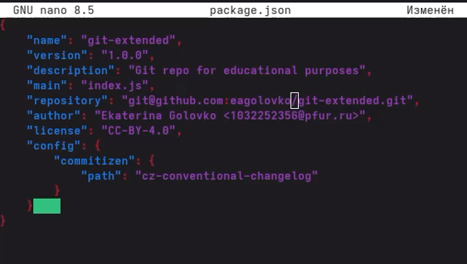
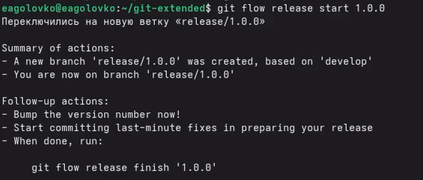

---
## Author
author:
  name: Головко Екатерина Андреевна
  degrees: DSc
  orcid: 0000-0002-0877-7063
  email: 1032252356@rudn.ru
  affiliation:
    - name: Российский университет дружбы народов
      country: Российская Федерация
      postal-code: 117198
      city: Москва
      address: ул. Миклухо-Маклая, д. 6
## Title
title: Лабораторная работа №4
subtitle: Операционные системы
license: CC BY
date: today
date-format: "YYYY-MM-DD" # Example: 2025-09-06
---

# Информация

## Докладчик

:::::::::::::: {.columns align=center}
::: {.column width="70%"}

  * Головко Екатерина Андреевна
  * студент
  * студент ФФМиЕН НБИ
  * Российский университет дружбы народов им. П. Лумумбы
  * [1032252356@rudn.ru](mailto:1032252356@rudn.ru)

:::
::: {.column width="30%"}

:::
::::::::::::::

## Цель

Получение навыков правильной работы с репозиториями git.

## Задание

1. Установка программного обеспечения
2. Практический сценарий использования git

# Выполнение лабораторной работы

## Установка программного обеспечения

Для начала устанавливаю gitflow, затем устанавливаю Node.js и настраиваю его. После устанавливаю программы для форматирования коммитов и создания логов

## Практический сценарий использования git

## Конфигурация общепринятых коммитов

Добавляю команду для формирования коммита в файл package.json после выполнения команды pnpm init

## Конфигурация gitflow

## Работа с репозиторием git

# Вывод

## Вывод

В ходе выполнения данной лабораторной работы я получила навыки правильной работы с github.

