---
## Author
author:
  name: Головко Екатерина Андреевна
  degrees: DSc
  orcid: 0000-0002-0877-7063
  email: 1032252356@rudn.ru
  affiliation:
    - name: Российский университет дружбы народов
      country: Российская Федерация
      postal-code: 117198
      city: Москва
      address: ул. Миклухо-Маклая, д. 6

## Title
title: "Отчет по лабораторной работе №4"
subtitle: "Операционные системы"
license: "CC BY"
---

# Цель работы

Получение навыков правильной работы с репозиториями git.

# Задание

1. Установка программного обеспечения
2. Практический сценарий использования git

# Теоретическое введение

##Общая информация

- Gitflow Workflow опубликована и популяризована Винсентом Дриссеном.
- Gitflow Workflow предполагает выстраивание строгой модели ветвления с учётом выпуска проекта.
- Данная модель отлично подходит для организации рабочего процесса на основе релизов.
- Работа по модели Gitflow включает создание отдельной ветки для исправлений ошибок в рабочей среде.
- Последовательность действий при работе по модели Gitflow:
	1. Из ветки master создаётся ветка develop.
        2. Из ветки develop создаётся ветка release.
        3. Из ветки develop создаются ветки feature.
        4. Когда работа над веткой feature завершена, она сливается с веткой develop.
        5. Когда работа над веткой релиза release завершена, она сливается в ветки develop и master.
        6. Если в master обнаружена проблема, из master создаётся ветка hotfix.
        7. Когда работа над веткой исправления hotfix завершена, она сливается в ветки develop и master.

# Выполнение лабораторной работы

## Установка программного обеспечения

### Установка gitflow

Устанавливаю gitflow ([рис. @fig-001], [рис. @fig-002], рис. [@fig-003]).

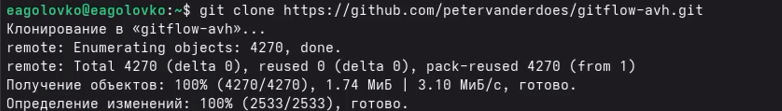{#fig-001 width=70%}

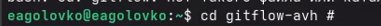{#fig-002 width=70%}

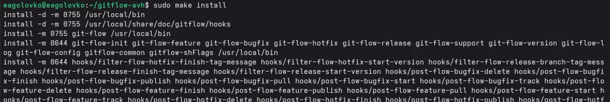{#fig-003 width=70%}

Проверяю версию установленного gitflow, чтобы убедиться, что все скачано верно ([рис. @fig-004]).

{#fig-004 width=70%}

### Установка Node.js

В терминале устанавливаю Node.js ([рис. @fig-005], [рис. @fig-006]).

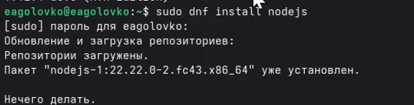{#fig-005 width=70%}

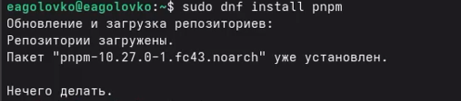{#fig-006 width=70%}

### Настройка Node.js

Настраиваю Node.js ([рис. @fig-007]).

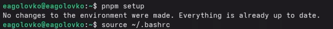{#fig-007 width=70%}

### Общепринятые коммиты

1. commitizen (форматирование коммитов) ([рис. @fig-008]).

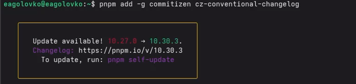{#fig-008 width=70%}

2. standard-changelog (создание логов) ([рис. @fig-009]).

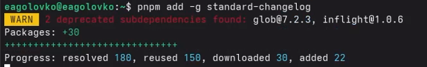{#fig-009 width=70%}

## Практический сценарий использования git

### Создание репозитория git

Создала в гитхабе репозиторий с названием git-extended.

Создаю у себя каталог и перехожу в него ([рис. @fig-010]).

{#fig-010 width=70%}

Инициализирую пустой репозиторий ([рис. @fig-011]).

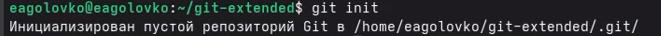{#fig-011 width=70%}

Переключаюсь на ветку master ([рис. @fig-012]).

{#fig-012 width=70%}

Делаю первый коммит и выкладываю на гитхаб, а также создаю файл ([рис. @fig-013], [рис. @fig-014], [рис. @fig-015]).

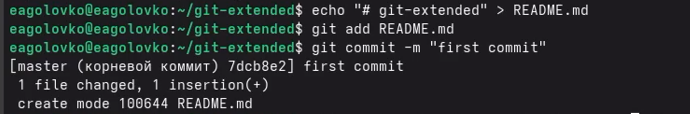{#fig-013 width=70%}

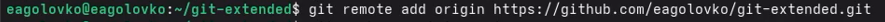{#fig-014 width=70%}

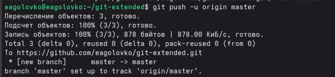{#fig-015 width=70%}

### Конфигурация общепринятых коммитов

Добавляю команду для формирования коммита в файл package.json после выполнения команды pnpm init ([рис. @fig-016]).

{#fig-016 width=70%}

Добавляю новые файлы, выполняю коммит и отправляю на гитхаб ([рис. @fig-017]).

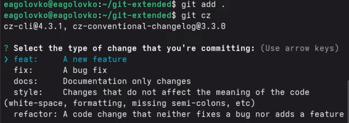{#fig-017 width=70%}

### Конфигурация gitflow

Инициализирую git-flow ([рис. @fig-018]).

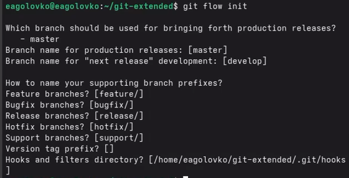{#fig-018 width=70%}

Проверяю, что я на ветке develop ([рис. @fig-019]).

{#fig-019 width=70%}

Загружаю весь репозиторий в хранилище ([рис. @fig-020]).

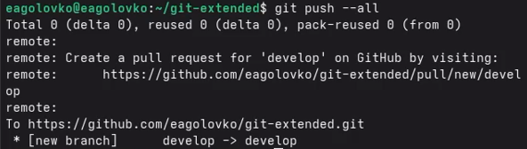{#fig-020 width=70%}

Установливаю внешнюю ветку как вышестоящую для этой ветки ([рис. @fig-021]).

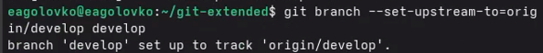{#fig-021 width=70%}

Создаю релиз с версией 1.0.0 ([рис. @fig-022]).

{#fig-022 width=70%}

Создаю журнал изменений ([рис. @fig-023]).

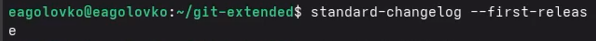{#fig-023 width=70%}

Добавляю журнал изменений в индекс ([рис. @fig-024]).

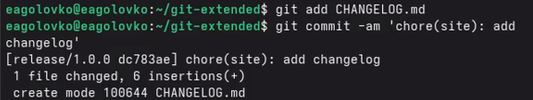{#fig-024 width=70%}

Заливаю релизную ветку в основную ветку ([рис. @fig-025]).

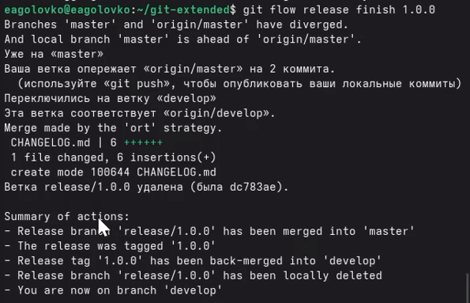{#fig-025 width=70%}

Отправляю данные н агитхаб ([рис. @fig-026], [рис. @fig-027]).

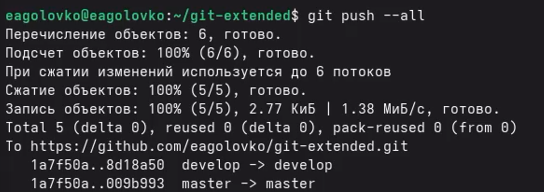{#fig-026 width=70%}

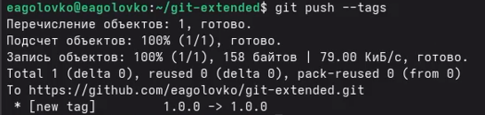{#fig-027 width=70%}

Создаю релиз, используя утилиты работы с гитхаб ([рис. @fig-028]).

{#fig-028 width=70%}

### Работа с репозиторием git

Создадаю ветку для новой функциональности ([рис. @fig-029]).

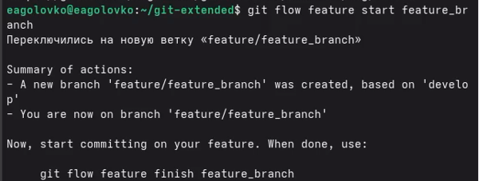{#fig-029 width=70%}

Разрабатываю новую функциональность ([рис. @fig-030]).

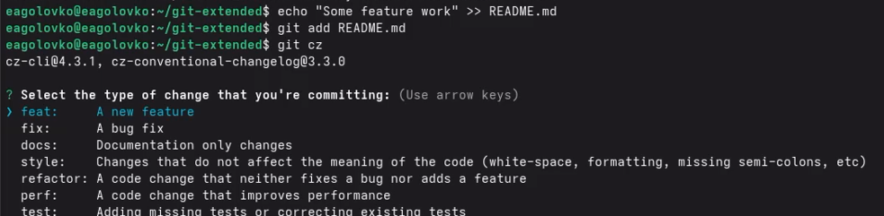{#fig-030 width=70%}

Объединяю ветку feature_branch c develop ([рис. @fig-031]).

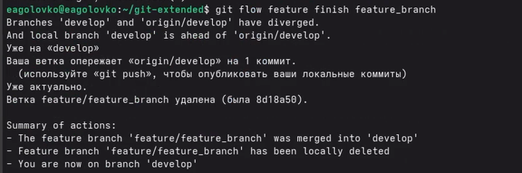{#fig-031 width=70%}

Создадаю релиз с версией 1.2.3 ([рис. @fig-032]).

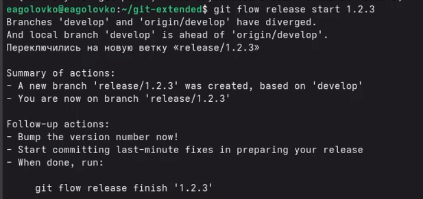{#fig-032 width=70%}

Обновляю номер версии в файле package.json. Установливаю её в 1.2.3 ([рис. @fig-033]).

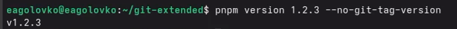{#fig-033 width=70%}

Создаю журнал изменений и добавляю его в индекс([рис. @fig-034]).

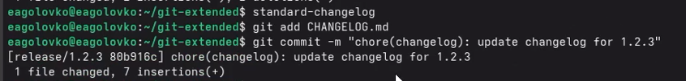{#fig-034 width=70%}

Заливаю релизную ветку в основную ветку ([рис. @fig-035]).

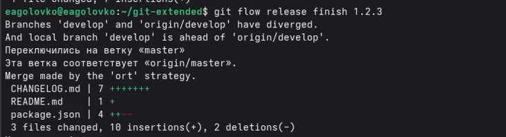{#fig-035 width=70%}

Отправляю данные на гитхаб ([рис. @fig-036], [рис. @fig-037]).

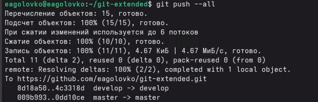{#fig-036 width=70%}

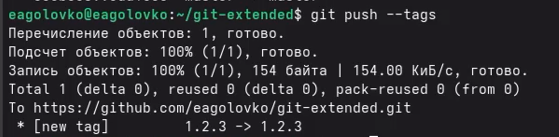{#fig-037 width=70%}

Создаю релиз на гитхаб с комментарием из журнала изменений ([рис. @fig-038]).

{#fig-038 width=70%}

# Выводы

В ходе выполнения данной лабораторной работы я получила навыки правильной работы с github.
