---
## Author
author:
  name: Головко Екатерина Андреевна
  degrees: DSc
  orcid: 0000-0002-0877-7063
  email: 1032252356@rudn.ru
  affiliation:
    - name: Российский университет дружбы народов
      country: Российская Федерация
      postal-code: 117198
      city: Москва
      address: ул. Миклухо-Маклая, д. 6
## Title
title: Лабораторная работа №4
subtitle: Операционные системы
license: CC BY
date: today
date-format: "YYYY-MM-DD" # Example: 2025-09-06
---

# Информация

## Докладчик

:::::::::::::: {.columns align=center}
::: {.column width="70%"}

  * Головко Екатерина Андреевна
  * студент
  * студент ФФМиЕН НБИ
  * Российский университет дружбы народов им. П. Лумумбы
  * [1032252356@rudn.ru](mailto:1032252356@rudn.ru)

:::
::: {.column width="30%"}

:::
::::::::::::::

## Цель работы

Научиться работать с менеджером паролей pass и управлять файлами конфигурации.

## Задание

1. Менеджер паролей pass
2. Дополнительное программное обеспечение

# Выполнение лабораторной работы

# Менеджер паролей pass

## Установка

Устанавливаю pass, pass-otp и gopass ([рис. @fig-001], [рис. @fig-002]).

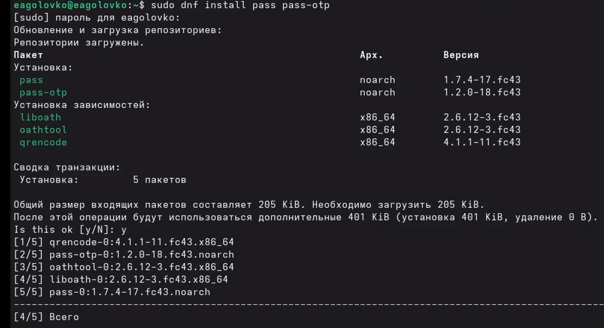{#fig-001 width=35%}

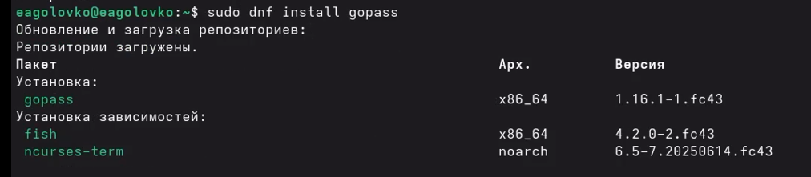{#fig-002 width=35%}

## Настройка

Инициализирую хранилище и создаю структуру git ([рис. @fig-003]).

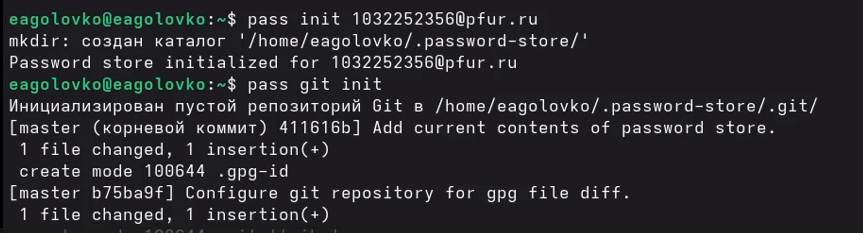{#fig-003 width=70%}

## Настройка

Создаю репозиторий ([рис. @fig-004]).

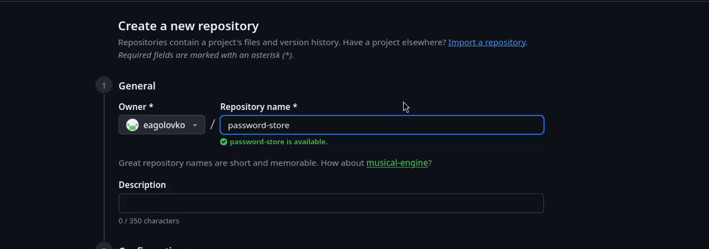{#fig-004 width=70%}

## Настройка

Задаю адрес репозитория на хостинге ([рис. @fig-005]).

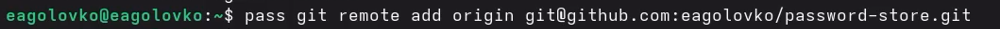{#fig-005 width=70%}

## Настройка

Синхронизирую ([рис. @fig-006]).

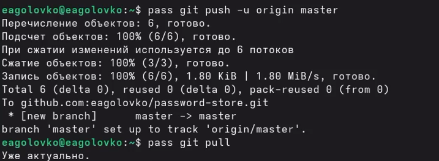{#fig-006 width=70%}

## Настройка интерфейса с броузером

Устанавливаю программу, обеспечивающую native messaging ([рис. @fig-007]).

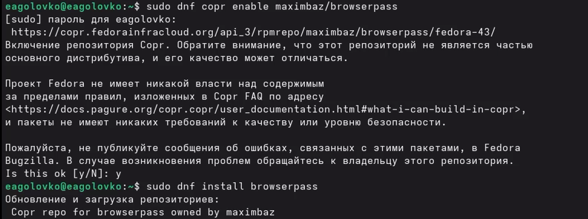{#fig-007 width=70%}

## Настройка интерфейса с броузером

Устанавливаю плагин для браузера ([рис. @fig-008]).

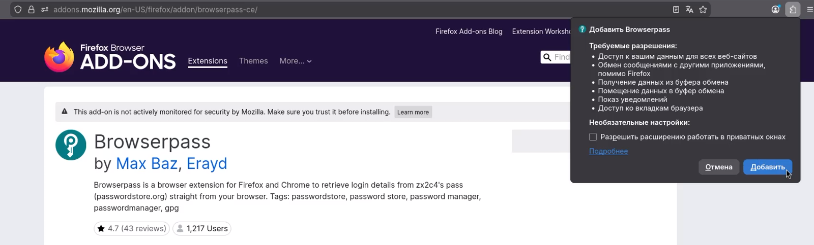{#fig-008 width=70%}

## Сохранение пароля

Добавляю новый пароль и отображаю его ([рис. @fig-009]).

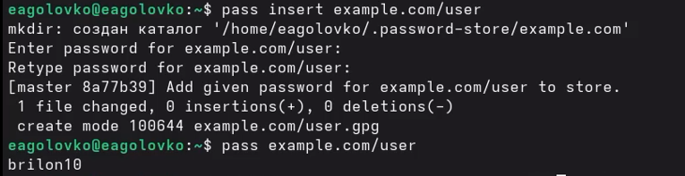{#fig-009 width=70%}

## Сохранение пароля

Заменяю существующий пароль ([рис. @fig-010]).

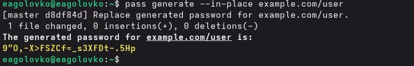{#fig-010 width=70%}

# Дополнительное программное обеспечение

## Дополнительное программное обеспечение

Устанавливаю дополнительное ПО и шрифты ([рис. @fig-011], [рис. @fig-012], [рис. @fig-013]).([рис. @fig-014]).

{#fig-011 width=70%}

{#fig-012 width=70%}

{#fig-013 width=70%}

{#fig-014 width=70%}

## Дополнительное программное обеспечение

Устанавливаю бинарный файл ([рис. @fig-015]).

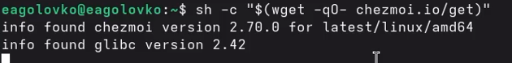{#fig-015 width=70%}

## Дополнительное программное обеспечение

Создаю свой репозиторий для конфигурационных файлов на основе шаблона ([рис. @fig-016]).

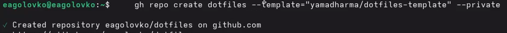{#fig-016 width=70%}

## Дополнительное программное обеспечение

Инициализирую chezmoi с моим репозиторием dotfiles ([рис. @fig-017).

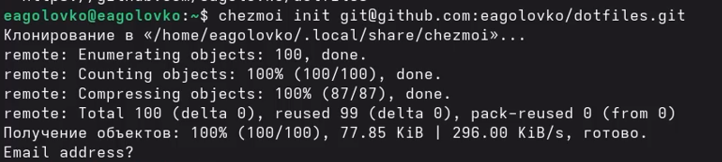{#fig-017 width=70%}

## Дополнительное программное обеспечение

Проверяю изменения внес chezmoi в домашний каталог с помощью команды chezmoi diff ([рис. @fig-018]).

{#fig-018 width=70%}

## Дополнительное программное обеспечение

Меня все устраивает, поэтому ввожу команду chezmoi apply -v ([рис. @fig-019]).

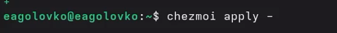{#fig-019 width=70%}

## Дополнительное программное обеспечение

Создаю вторую виртуальную машину, настраиваю, перехожу в терминал и иницилизирую репозиторий dotfiles ([рис. @fig-020]).

{#fig-020 width=70%}

## Дополнительное программное обеспечение

Выполняю команду приведенную в лабораторной работе ([рис. @fig-021]).

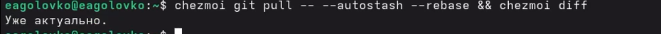{#fig-021 width=70%}

## Дополнительное программное обеспечение

Редактирую файл ~/.config/chezmoi/chezmoi.toml ([рис. @fig-022]).

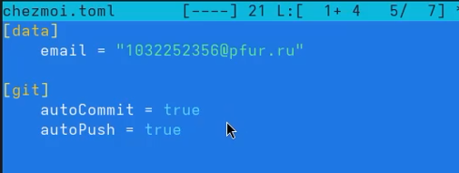{#fig-022 width=70%}

# Выводы

## Выводы

В ходе данной лабораторной работы я научилась работать с менеджером паролей и управлять файлами конфигурации.

