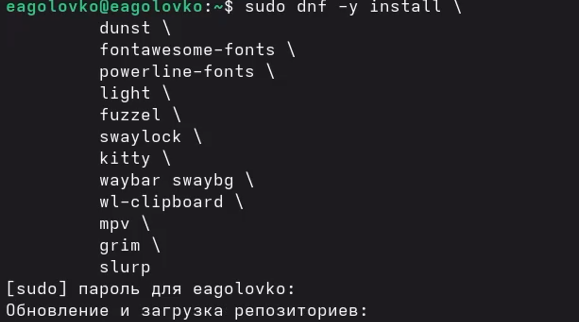
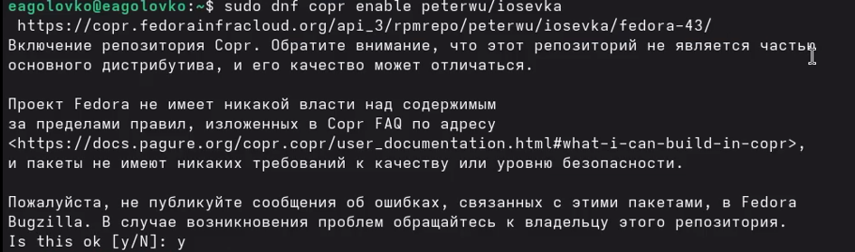
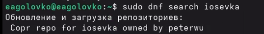
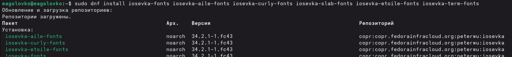
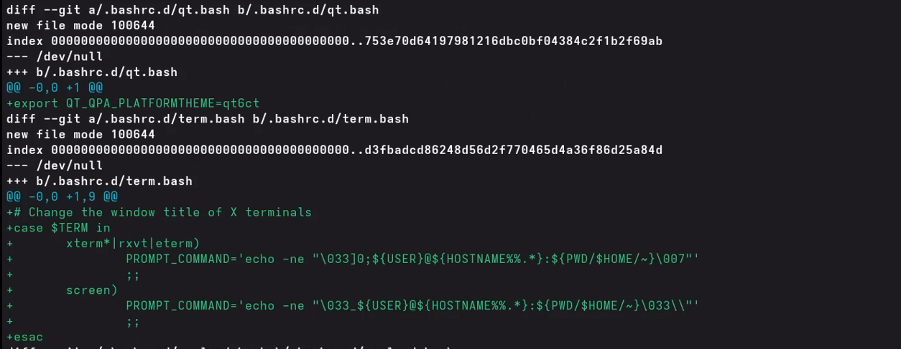
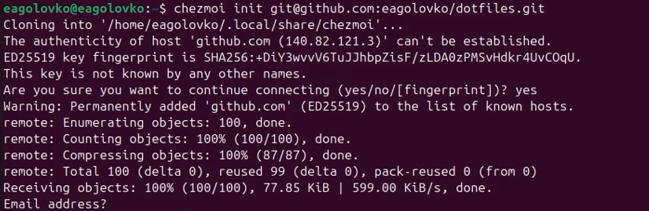

---
## Author
author:
  name: Головко Екатерина Андреевна
  degrees: DSc
  orcid: 0000-0002-0877-7063
  email: 1032252356@rudn.ru
  affiliation:
    - name: Российский университет дружбы народов
      country: Российская Федерация
      postal-code: 117198
      city: Москва
      address: ул. Миклухо-Маклая, д. 6

## Title
title: "Отчет по лабораторной работе №5"
subtitle: "Операционные системы"
license: "CC BY"
---

# Цель работы

Научиться работать с менеджером паролей pass и управлять файлами конфигурации.

# Задание

1. Менеджер паролей pass
2. Дополнительное программное обеспечение

# Теоретическое введение

## Структура базы паролей
 - Структура базы может быть произвольной, если Вы собираетесь использовать её напрямую, без промежуточного программного обеспечения. Тогда семантику структуры базы данных Вы держите в своей голове.
 - Если же необходимо использовать дополнительное программное обеспечение, необходимо семантику заложить в структуру базы паролей.

## Рабочие файлы

 - Состояние файлов конфигурации сохраняется в каталоге ~/.local/share/chezmoi
 - Он является клоном вашего репозитория dotfiles.
 - Файл конфигурации ~/.config/chezmoi/chezmoi.toml (можно использовать также JSON или YAML) специфичен для локальной машины.
 - Файлы, содержимое которых одинаково на всех ваших машинах, дословно копируются из исходного каталога.
 - Файлы, которые варьируются от машины к машине, выполняются как шаблоны, обычно с использованием данных из файла конфигурации локальной машины для настройки конечного содержимого, специфичного для локальной машины.
 - При запуске chezmoi apply вычисляется желаемое содержимое и разрешения для каждого файла, а затем вносит необходимые изменения, чтобы ваши файлы соответствовали этому состоянию.
 - По умолчанию chezmoi изменяет файлы только в рабочей копии.

# Выполнение лабораторной работы

## Менеджер паролей pass

### Установка

Устанавливаю pass, pass-otp и gopass ([рис. @fig-001], [рис. @fig-002]).

{#fig-001 width=70%}

{#fig-002 width=70%}

### Настройка

Инициализирую хранилище и создаю структуру git ([рис. @fig-003]).

{#fig-003 width=70%}

Создаю репозиторий ([рис. @fig-004]).

{#fig-004 width=70%}

Задаю адрес репозитория на хостинге ([рис. @fig-005]).

{#fig-005 width=70%}

Синхронизирую ([рис. @fig-006]).

{#fig-006 width=70%}

### Настройка интерфейса с броузером

Устанавливаю программу, обеспечивающую native messaging ([рис. @fig-007]).

{#fig-007 width=70%}

Устанавливаю плагин для браузера ([рис. @fig-008]).

{#fig-008 width=70%}

### Сохранение пароля

Добавляю новый пароль и отображаю его ([рис. @fig-009]).

{#fig-009 width=70%}

Заменяю существующий пароль ([рис. @fig-010]).

{#fig-010 width=70%}

## Дополнительное программное обеспечение

Устанавливаю дополнительное ПО и шрифты ([рис. @fig-011], [рис. @fig-012], [рис. @fig-013]).([рис. @fig-014]).

{#fig-011 width=70%}

{#fig-012 width=70%}

{#fig-013 width=70%}

{#fig-014 width=70%}

Устанавливаю бинарный файл ([рис. @fig-015]).

{#fig-015 width=70%}

Создаю свой репозиторий для конфигурационных файлов на основе шаблона ([рис. @fig-016]).

{#fig-016 width=70%}

Инициализирую chezmoi с моим репозиторием dotfiles ([рис. @fig-017).

{#fig-017 width=70%}

Проверяю изменения внес chezmoi в домашний каталог с помощью команды chezmoi diff ([рис. @fig-018]).

{#fig-018 width=70%}

Меня все устраивает, поэтому ввожу команду chezmoi apply -v ([рис. @fig-019]).

{#fig-019 width=70%}

Создаю вторую виртуальную машину, настраиваю, перехожу в терминал и иницилизирую репозиторий dotfiles ([рис. @fig-020]).

{#fig-020 width=70%}

Выполняю команду приведенную в лабораторной работе ([рис. @fig-021]).

{#fig-021 width=70%}

Редактирую файл ~/.config/chezmoi/chezmoi.toml ([рис. @fig-022]).

{#fig-022 width=70%}

# Выводы

В ходе данной лабораторной работы я научилась работать с менеджером паролей и управлять файлами конфигурации.
