---
## Author
author:
  name: Головко Екатерина Андреевна
  degrees: DSc
  orcid: 0000-0002-0877-7063
  email: 1032252356@rudn.ru
  affiliation:
    - name: Российский университет дружбы народов
      country: Российская Федерация
      postal-code: 117198
      city: Москва
      address: ул. Миклухо-Маклая, д. 6

## Title
title: "Отчет по лабораторной работе №6"
subtitle: "Операционные системы"
license: "CC BY"
---

# Цель работы

Приобретение практических навыков взаимодействия пользователя с системой посредством командной строки.

# Задание

1. Определите полное имя вашего домашнего каталога. Далее относительно этого каталога будут выполняться последующие упражнения.
2. Выполните следующие действия:
  2.1. Перейдите в каталог /tmp.
  2.2. Выведите на экран содержимое каталога /tmp. Для этого используйте команду ls с различными опциями. Поясните разницу в выводимой на экран информации.
  2.3. Определите, есть ли в каталоге /var/spool подкаталог с именем cron?
  2.4. Перейдите в Ваш домашний каталог и выведите на экран его содержимое. Определите, кто является владельцем файлов и подкаталогов?
3. Выполните следующие действия:
  3.1. В домашнем каталоге создайте новый каталог с именем newdir.
  3.2. В каталоге ~/newdir создайте новый каталог с именем morefun.
  3.3. В домашнем каталоге создайте одной командой три новых каталога с именами letters, memos, misk. Затем удалите эти каталоги одной командой.
  3.4. Попробуйте удалить ранее созданный каталог ~/newdir командой rm. Проверьте, был ли каталог удалён.
  3.5. Удалите каталог ~/newdir/morefun из домашнего каталога. Проверьте, был ли каталог удалён.
4. С помощью команды man определите, какую опцию команды ls нужно использовать для просмотра содержимое не только указанного каталога, но и подкаталогов, входящих в него.
5. С помощью команды man определите набор опций команды ls, позволяющий отсортировать по времени последнего изменения выводимый список содержимого каталога с развёрнутым описанием файлов.
6. Используйте команду man для просмотра описания следующих команд: cd, pwd, mkdir, rmdir, rm. Поясните основные опции этих команд.
7. Используя информацию, полученную при помощи команды history, выполните модификацию и исполнение нескольких команд из буфера команд.

# Теоретическое введение

  В операционной системе типа Linux взаимодействие пользователя с системой обычно осуществляется с помощью командной строки посредством построчного ввода команд. При этом обычно используется командные интерпретаторы языка shell: /bin/sh; /bin/csh; /bin/ksh.
  Формат команды. Командой в операционной системе называется записанный по специальным правилам текст (возможно с аргументами), представляющий собой указание на выполнение какой-либо функций (или действий) в операционной системе.
  Обычно первым словом идёт имя команды, остальной текст — аргументы или опции, конкретизирующие действие.
  Общий формат команд можно представить следующим образом:
     - <имя_команды><разделитель><аргументы>

# Выполнение лабораторной работы

Определяю полное имя моего домашнего каталога ([рис. @fig-001]).

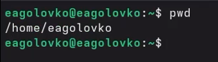{#fig-001 width=70%}

Перехожу в каталог /tmp ([рис. @fig-002]).

{#fig-002 width=70%}

Вывожу только имена файлов и каталогов ([рис. @fig-003]).

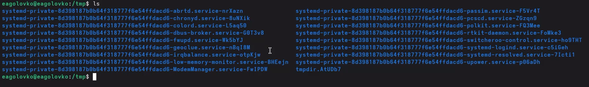{#fig-003 width=70%}

Вывожу подробный список (права, владелец, размер, дата) ([рис. @fig-004]).

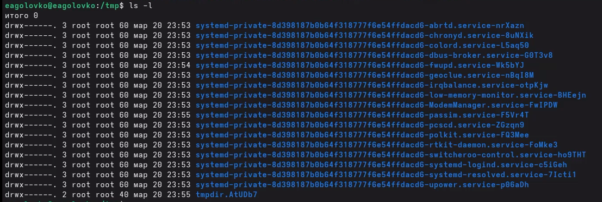{#fig-004 width=70%}

Вывожу список файлов, включая скрытые ([рис. @fig-005]).

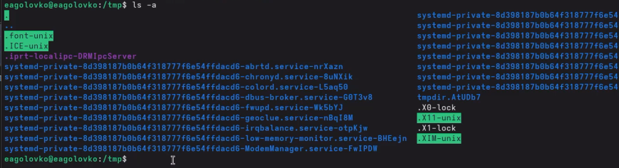{#fig-005 width=70%}

Вывожу комбинацию предыдущих опций ([рис. @fig-006]).

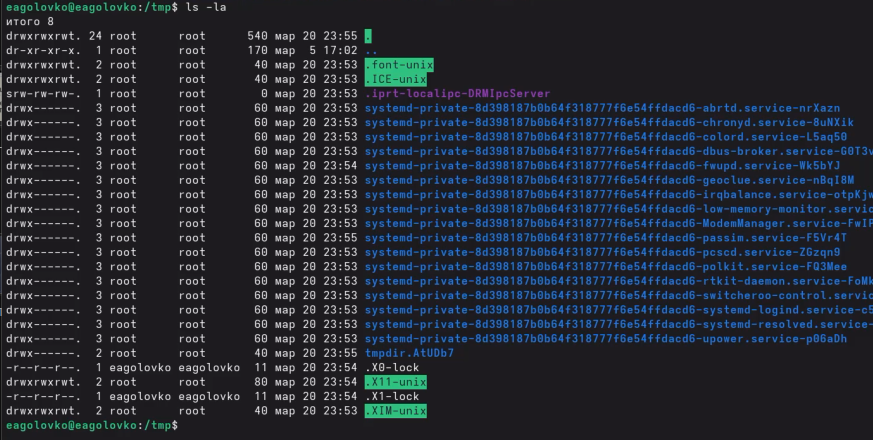{#fig-006 width=70%}

Проверяю наличие подкаталога cron в /var/spool и благодаря выводу, убеждаюсь в том, что он есть([рис. @fig-007]).

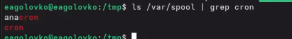{#fig-007 width=70%}

Перехожу в домашний каталог и вывожу его содержимое ([рис. @fig-008]).

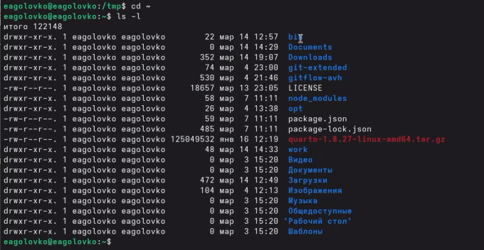{#fig-008 width=70%}

Создаю каталог и подкаталог, используя команду mkdir ([рис. @fig-009]).

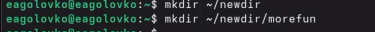{#fig-009 width=70%}

Создаю 3 каталога одновременно, используя команду mkdir ([рис. @fig-010]).

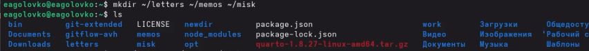{#fig-010 width=70%}

Удаляю 3 каталога одновременно, используя команду mkdir ([рис. @fig-011]).

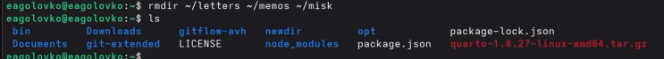{#fig-011 width=70%}

Появляется ошибка о том, что данная команда без опций удаляет только файлы ([рис. @fig-012]).

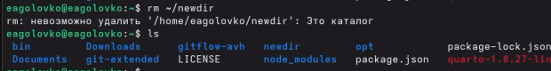{#fig-012 width=70%}

Удаление каталога и подкаталога, с помощью команды ls убеждаюсь в том, что этот каталог действительно удален ([рис. @fig-013]).

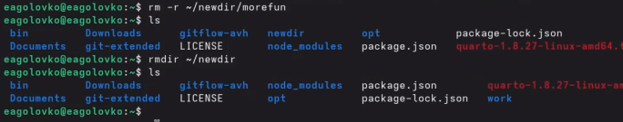{#fig-013 width=70%}

Для просмотра содержимого не только указанного каталога, но и подкаталогов - необходимо использовать команду ls с опцией -R. Дальше я определила набор опций, который необходим для сортировки по времени последнего изменения с развернутым описанием ([рис. @fig-014]).

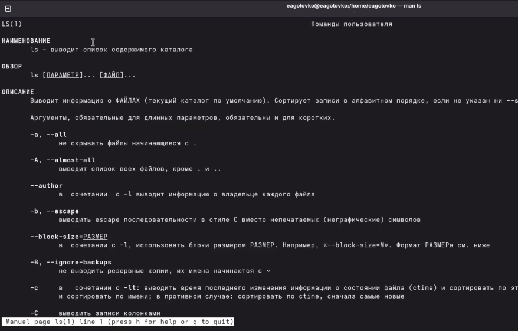{#fig-014 width=70%}

С помощью команды man, просматриваю опции команды cd. И убеждаюсь в том, что эта команда без опций, просто смена каталога ([рис. @fig-015]).

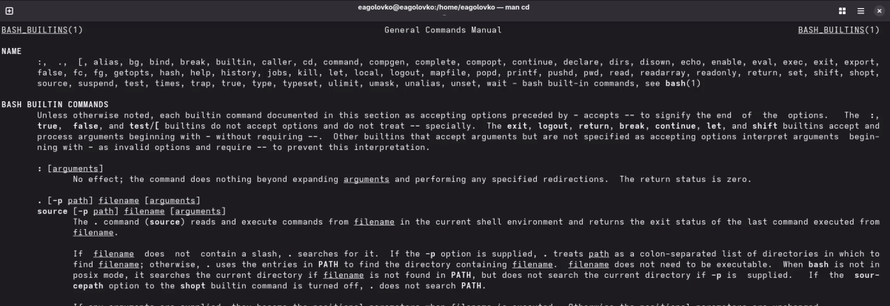{#fig-015 width=70%}

С помощью команды man, просматриваю опции команды pmd. И убеждаюсь в том, что эта команда без опций, вывод текущего каталога ([рис. @fig-016]).

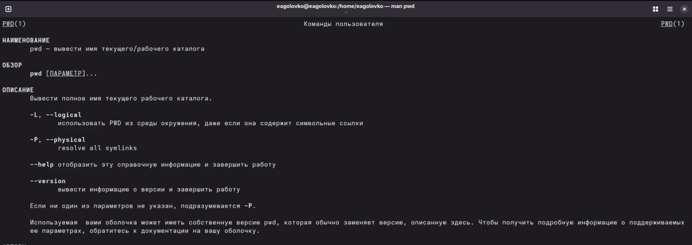{#fig-016 width=70%}

С помощью команды man, просматриваю опции команды mkdir. И убеждаюсь в том, что основные опции этой команды: -p(создание родительских каталогов), -m(задание прав доступа) ([рис. @fig-017]).

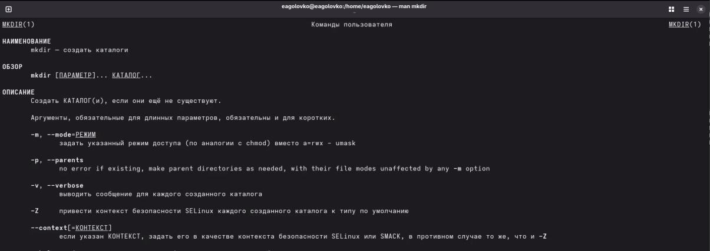{#fig-017 width=70%}

С помощью команды man, просматриваю опции команды rmdir. И убеждаюсь в том, что эта команда без основных опций, удаление только пустых каталогов ([рис. @fig-018]).

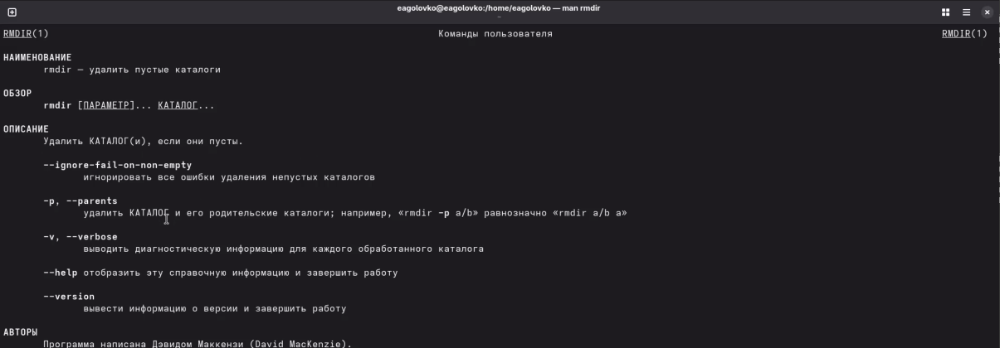{#fig-018 width=70%}

С помощью команды man, просматриваю опции команды rm. И убеждаюсь в том, что основные опции этой команды: -r(рекурсивное удаление для каталогов), -f(принудительное удаление), -i(запрос подтверждения) ([рис. @fig-016]). ([рис. @fig-019]).

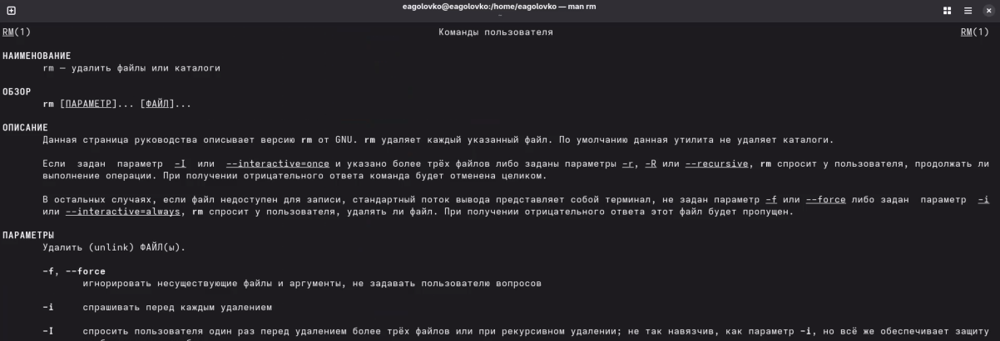{#fig-019 width=70%}

Вывод истории команд ([рис. @fig-020]).

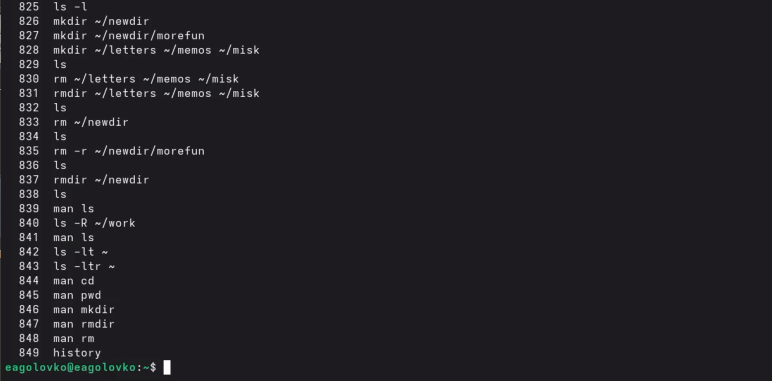{#fig-020 width=70%}

Повторное использование команды без прописывания ее ([рис. @fig-021]).

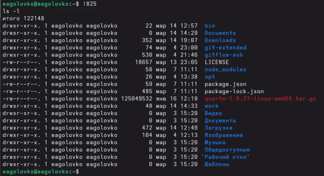{#fig-021 width=70%}

Модернизация команды, взятой из истории команд в терминале ([рис. @fig-022]).

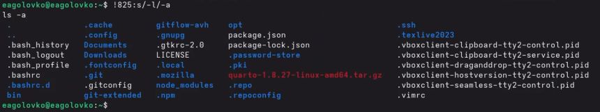{#fig-022 width=70%}

# Выводы

В ходе данной лабораторной работы я приобрела навыки взаимодействия пользователя с системой посредстов командной строки.

