---
## Author
author:
  name: Головко Екатерина Андреевна
  degrees: DSc
  orcid: 0000-0002-0877-7063
  email: 1032252356@rudn.ru
  affiliation:
    - name: Российский университет дружбы народов
      country: Российская Федерация
      postal-code: 117198
      city: Москва
      address: ул. Миклухо-Маклая, д. 6

## Title
title: "Отчет по лабораторной работе №7"
subtitle: "Операционные системы"
license: "CC BY"
---

# Цель работы

Ознакомиться с файловой системой Linux, её структурой, именами и содержанием каталогов. Приобрести практические навыки по применению команд для работы с файлами и каталогами, по управлению процессами (и работами), по проверке использовани диска и обслуживанию файловой системы.

# Задание

1. Выполнить все примеры, приведенные в первой части описания лабораторной работы

2. Выполнить действия, указанные в пункте 2 последовательности выполнения

3. Определить опции команды chmod

4. Проделать упражнения из пункта 4 последовательности выполнения

5. Прочитать man по командам mount, fsck, mkfs, kill и кратко охарактеризовать их

# Теоретическое введение

Для создания текстового файла можно использовать команду touch. Формат команды:

```

touch имя-файла

```

Для просмотра файлов небольшого размера можно использовать команду cat. Формат команды:

```

cat имя-файла

```

Для просмотра файлов постранично удобнее использовать команду less. Формат команды:

```

less имя-файла

```

Команда head выводит по умолчанию первые 10 строк файла. Формат команды:

```

head [-n] имя-файла,

```

Команда tail выводит умолчанию 10 последних строк файла. Формат команды:

```

tail [-n] имя-файла

```

Команда cp используется для копирования файлов и каталогов. Формат команды:

```

cp [-опции] исходный_файл целевой_файл

```

Опция i в команде cp выведет на экран запрос подтверждения о перезаписи файла. Для рекурсивного копирования каталогов, содержащих файлы, используется команда cp с опцией r.

Команды mv и mvdir предназначены для перемещения и переименования файлов и каталогов. Формат команды mv:

```

mv [-опции] старый_файл новый_файл

```

# Выполнение лабораторной работы

## Задание №1

Создаю файл, просматриваю его, убеждаюсь в том, что он пуст, редактирую его и еще раз просматриваю ([рис. @fig-001]).

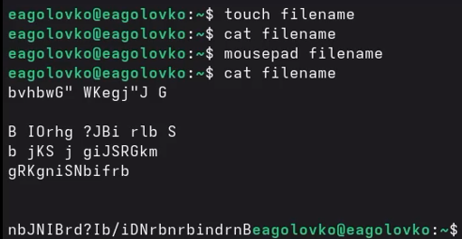{#fig-001 width=70%}

Просматриваю постранично с помощью команды less ([рис. @fig-002]).

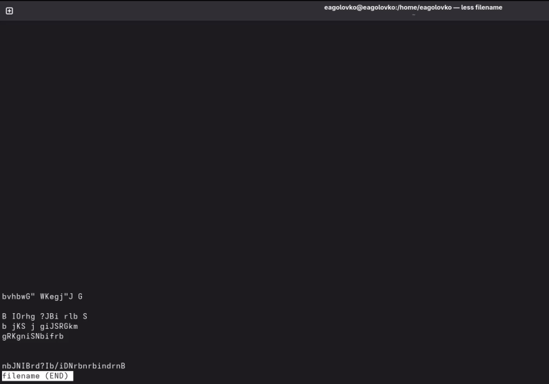{#fig-002 width=70%}

Вывожу первые 10 строк файла([рис. @fig-003]).

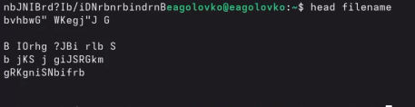{#fig-003 width=70%}

Вывожу последние 10 строк с помощью команды tail ([рис. @fig-004]).

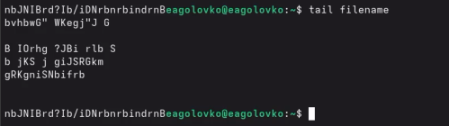{#fig-004 width=70%}

Создаю файл, копирую его два раза, но сразными именами и вывожу список файлов для того, чтобы убедиться в корректности выполнения команд ([рис. @fig-005]).

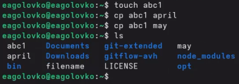{#fig-005 width=70%}

Создаю каталог, копирую в него файлы, убеждаюсь в правильности выполнения команд ([рис. @fig-006]).

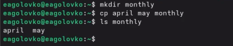{#fig-006 width=70%}

Копирую файл из незадействованного каталога в незадействованный каталог с другим названием([рис. @fig-007]).

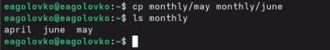{#fig-007 width=70%}

Создаю каталог, копирую другой каталог в только что созданный, убеждаюсь в корректности выполнения команд ([рис. @fig-008]).

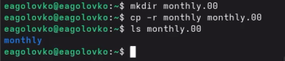{#fig-008 width=70%}

Снова копирую каталог в другой каталог([рис. @fig-009]).

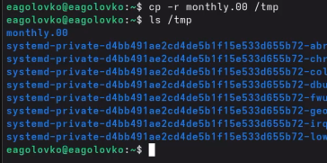{#fig-009 width=70%}

Меняю название файла в текущем каталоге ([рис. @fig-010]).

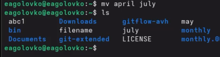{#fig-010 width=70%}

Перемещаю файл в другой каталог ([рис. @fig-011]).

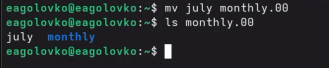{#fig-011 width=70%}

Перемещаю каталог в другой каталог, переименовываю каталог, который не является текущим ([рис. @fig-012]).

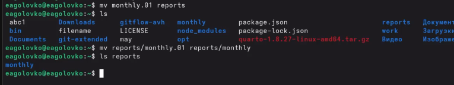{#fig-012 width=70%}

## Задание №2

Копирую файл, создаю каталог, перемещаю скопированный файл в созданный каталог, переименовываю скопированный файл, создаю файл1, копирую его с другим названием. Создаю подкаталг в каталоге, копирую туда прежде созданные файлы. Создаю еще один каталог и перемещаю его в ранее созданный и переименовываю ([рис. @fig-013]).

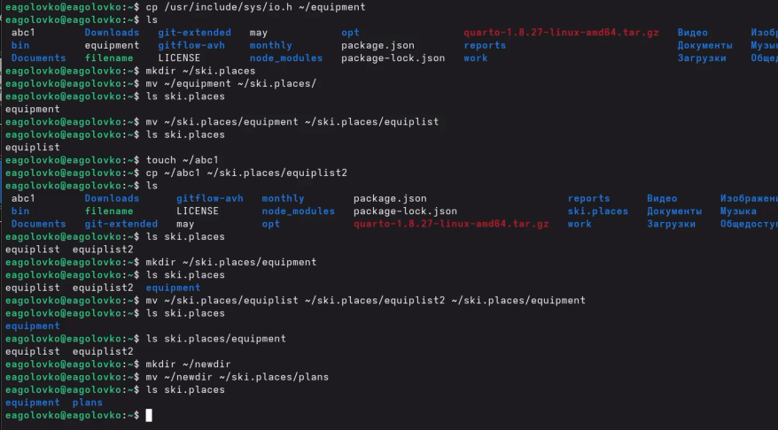{#fig-013 width=70%}

## Задание №3

Создаю необходимые файлы и даю им определенные права, используя восьмиричную систему для команды chmod ([рис. @fig-014]).

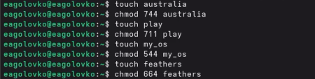{#fig-014 width=70%}

## Задание №4

Просматриваю содержимое файла /etc/passwd ([рис. @fig-015]).

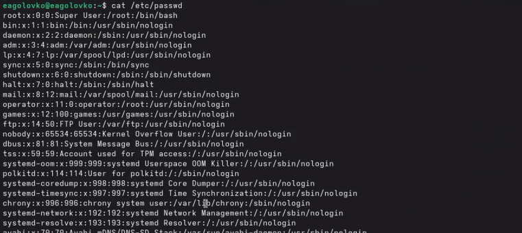{#fig-015 width=70%}

Копирую файл в другой файл ([рис. @fig-016]).

{#fig-016 width=70%}

Создаю каталог, перемещаю туда файл, убеждаюсь в корректности выполнения команд ([рис. @fig-017]).

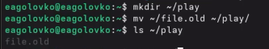{#fig-017 width=70%}

Создаю каталог, копирую в него другой каталог, проверяю. Затем перемещаю каталог в другой каталог и переименовываю его ([рис. @fig-018]).

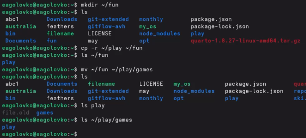{#fig-018 width=70%}

Лишаю владельца файла права на чтения, пытаюсь что-либо сделать с ним - выходит ошибка, возвращаю права и снова все работает ([рис. @fig-019]).

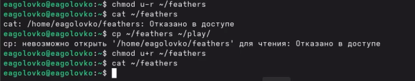{#fig-019 width=70%}

Лишаю владельца катлога права на выполнение, пытаюсь перейти в этот каталог, выходит ошибка, возвращаю права и снова все работает ([рис. @fig-020]).

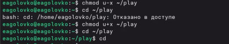{#fig-020 width=70%}

## Задание №5

Команда mount монтирует файловые системы ([рис. @fig-021]).

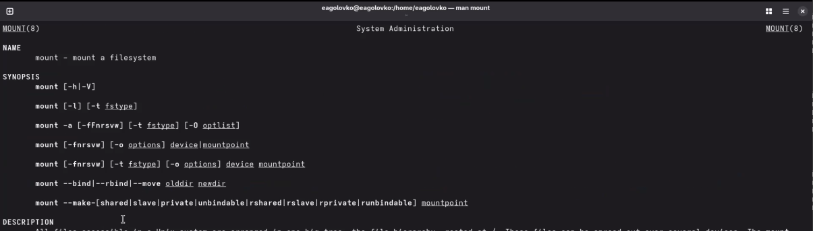{#fig-021 width=70%}

Команда fsck проверяет и восстановливает файловую систему ([рис. @fig-022]).

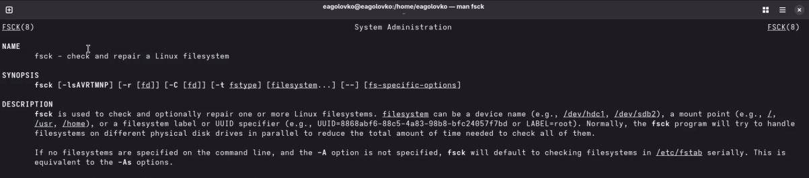{#fig-022 width=70%}

Команда mkfs создает файловую систему  ([рис. @fig-023]).

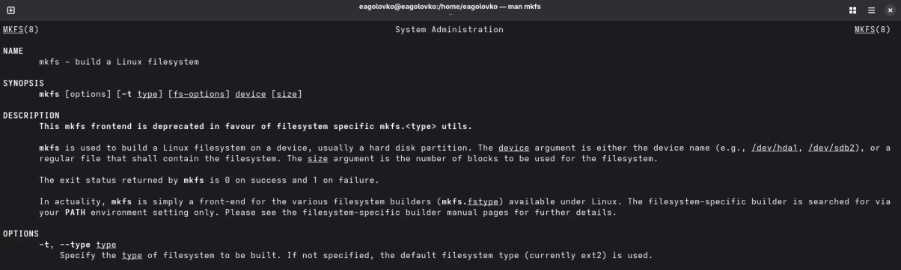{#fig-023 width=70%}

команда kill завершает процессы ([рис. @fig-024]).

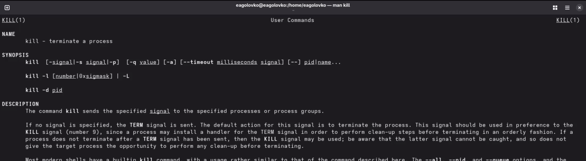{#fig-024 width=70%}

# Выводы

В ходе данной лабораторной работы ознакомилась с файловой системой Линукс, ее структурой, именами и содержанием каталогов. Приобрела практические навыки по применению команд для работы с файлами и каталогами, по управлению процессами (и работами), по проверке использования диска и обслуживанию файловой системы.
