---
## Author
author:
  name: Головко Екатерина Андреевна
  degrees: DSc
  orcid: 0000-0002-0877-7063
  email: 1032252356@rudn.ru
  affiliation:
    - name: Российский университет дружбы народов
      country: Российская Федерация
      postal-code: 117198
      city: Москва
      address: ул. Миклухо-Маклая, д. 6

## Title
title: "Отчет по лабораторной работе №8"
subtitle: "Операционные системы"
license: "CC BY"
---

# Цель работы

Ознакомление с инструментами поиска файлов и фильтрации текстовых данных. Приобретение практических навыков: по управлению процессами (и заданиями), по проверку использования диска и обслуживанию файловых систем.

# Задание

1. Вход в систему
2. Записывание информации в файл и дописывание информации
3. Вывод имен файлов с определенным разрешением
4. Определение файлов, начинающихся с определенного символа
5. Выведение постранично на экран имен файлов
6. Запуск процесса в фоновом режиме
7. Удаление файла
8. Запуск редактора в фоновом режиме
9. Определение идентификатора процесса
10. Завершение процесса
11. Выполнение команд df и du
12. Вывод имен всех директорий домашнего каталога

# Теоретическое введение

В системе по умолчанию открыто три специальных потока:
– stdin — стандартный поток ввода (по умолчанию: клавиатура), файловый дескриптор 0;
– stdout — стандартный поток вывода (по умолчанию: консоль), файловый дескриптор 1;
– stderr — стандартный поток вывод сообщений об ошибках (по умолчанию: консоль), файловый дескриптор 2.
Большинство используемых в консоли команд и программ записывают результаты своей работы в стандартный поток вывода stdout. Например, команда ls выводит в стандартный поток вывода (консоль) список файлов в текущей директории. Потоки вывода и ввода можно перенаправлять на другие файлы или устройства. Проще всего это делается с помощью символов >, >>, <, <<.

Конвейер (pipe) служит для объединения простых команд или утилит в цепочки, в которых результат работы предыдущей команды передаётся последующей. 

Чаще всего скрипты на Bash используются в качестве автоматизации каких-то рутинных операций в консоли, отсюда иногда возникает необходимость в обработке stdout одной команды и передача на stdin другой команде, при этом результат выполнения команды должен обработан.

Команда find используется для поиска и отображения на экран имён файлов, соответствующих заданной строке символов. 
Путь определяет каталог, начиная с которого по всем подкаталогам будет вестись поиск.

# Выполнение лабораторной работы

## Задание №1

Вхожу в систему с нужным именем пользоватея и открываю терминал ([рис. @fig-001]).

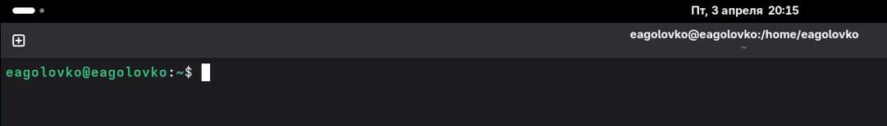{#fig-001 width=70%}

## Задание №2

Записываю в файл названия файлов, содержащихся в каталоге /etc. Затем дописываю в этот же файл названия файлов из домашнего каталога ([рис. @fig-002]).

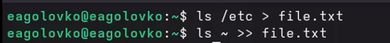{#fig-002 width=70%}

Результат работы команд ([рис. @fig-003]).

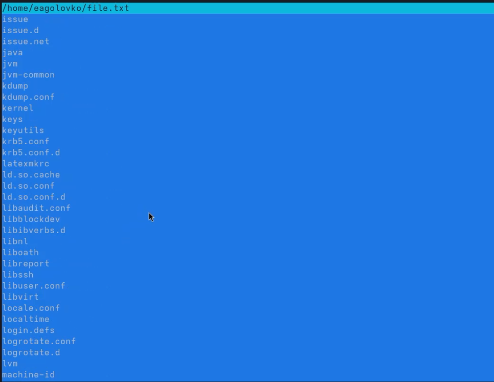{#fig-003 width=70%}

## Задание №3

Вывожу список имен файлов из file.txt, имеющих расширение .conf([рис. @fig-004]).

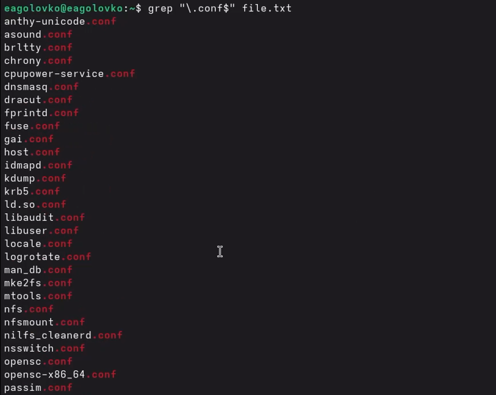{#fig-004 width=70%}

Записываю их в новый текстовый файл([рис. @fig-005]).

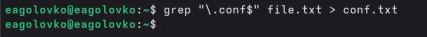{#fig-005 width=70%}

Результат работы предыдущей команды ([рис. @fig-006]).

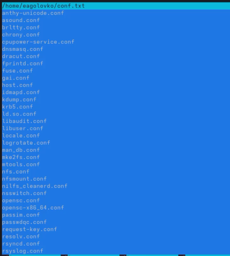{#fig-006 width=70%}

## Задание №4

Определяю, какие файлы в домашнем каталоге начинаются с символа с.

1 вариант ([рис. @fig-007]).

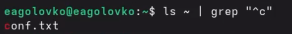{#fig-007 width=70%}

2 вариант ([рис. @fig-008]).

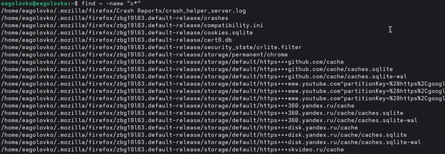{#fig-008 width=70%}

3 вариант ([рис. @fig-009]).

{#fig-009 width=70%}

## Задание №5

Вывожу имена файлов по странично из каталога /etc, начинающиеся с символа h ([рис. @fig-010]).

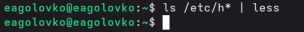{#fig-010 width=70%}

Результат ([рис. @fig-011]).

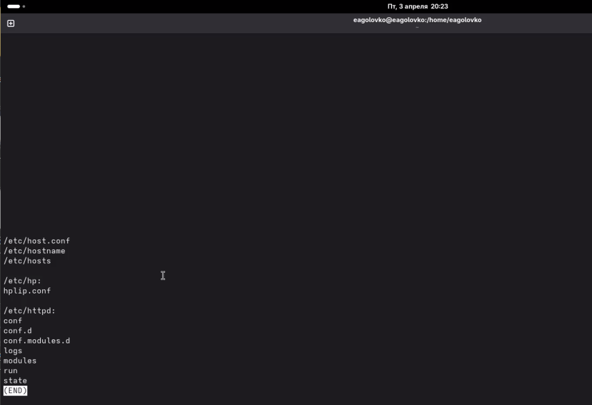{#fig-011 width=70%}

## Задание №6

Запускаю в фоновом режиме процесс, который будет записывать в файл ~/logfile файлы, имена которых начинаются с log ([рис. @fig-012]).

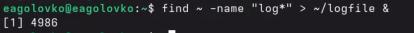{#fig-012 width=70%}

## Задание №7

Удаляю файл, который участвует в фоновом процессе, и из-за этого прерывается сам процесс ([рис. @fig-013]).

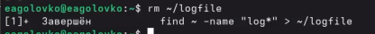{#fig-013 width=70%}

## Задание №8

Запускаю редактор gedit в фоновом режиме ([рис. @fig-014]).

{#fig-014 width=70%}

## Задание №9

Вывожу идентификатор процесса gedit([рис. @fig-015]).

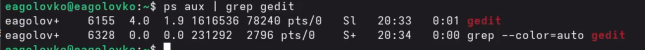{#fig-015 width=70%}

Еще один способ вывода идентификатора процесса ([рис. @fig-016]).

{#fig-016 width=70%}

## Задание №10

Читаю справку по команде kill ([рис. @fig-017]).

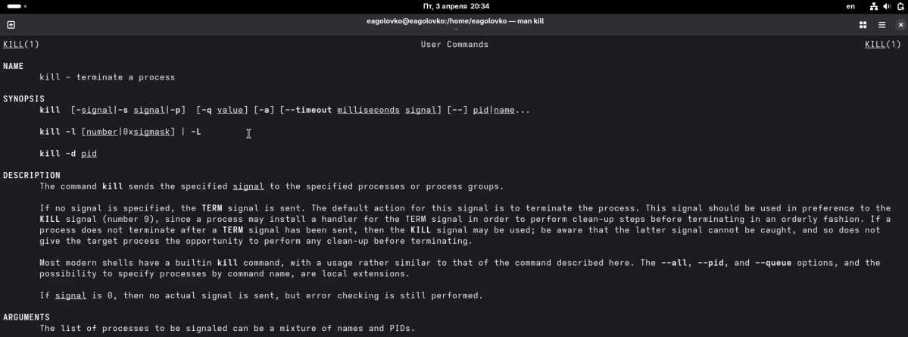{#fig-017 width=70%}

Узнав нужную информацию, прерываю процесс с помощью этой команды ([рис. @fig-018]).

{#fig-018 width=70%}

## Задание №11

Читаю справку по команде df, она показывает информацию об использовании пространства файловой системы ([рис. @fig-019]).

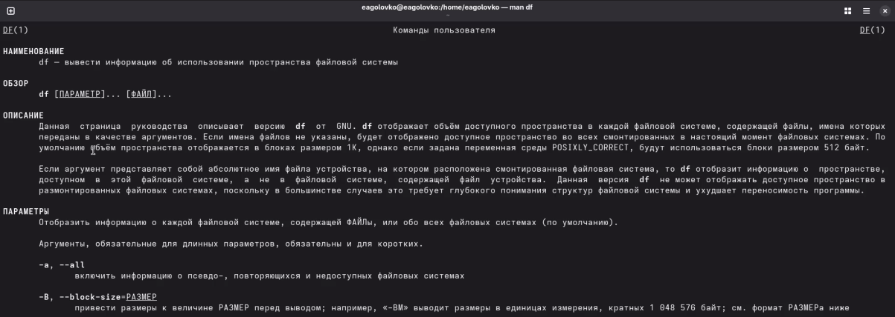{#fig-019 width=70%}

Результат этой команды ([рис. @fig-020]).

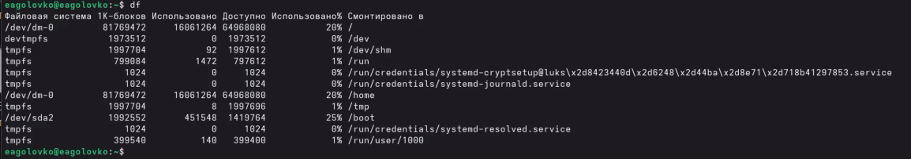{#fig-020 width=70%}

Читаю справку по команде du, она оценивает используемое файлами пространство ([рис. @fig-021]).

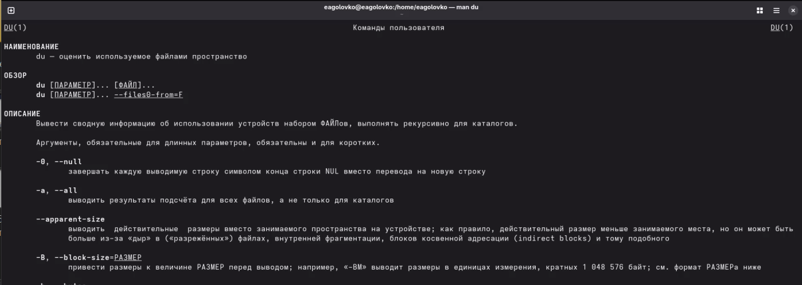{#fig-021 width=70%}

Результат этой команды ([рис. @fig-023]).

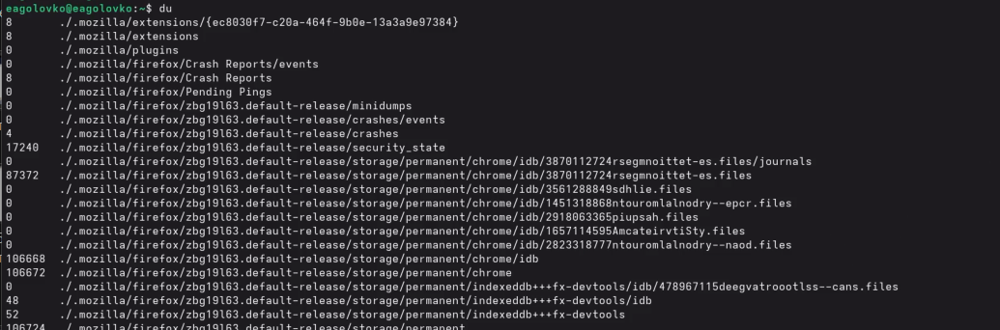{#fig-022 width=70%}

## Задание №12

Вывожу имена всех директорий из моего домашнего каталога ([рис. @fig-023]).

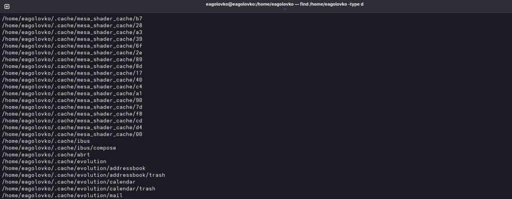{#fig-023 width=70%}

# Выводы

В ходе данной лабораторной работы я ознакомилась с инструментами поиска файлов и фильтрации текстовых данных, а также приобрела практические навыки по проверке использования диска, по управлению процессами и по обслуживанию файловых систем.
