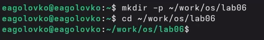
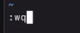
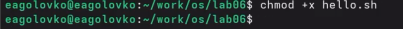

---
## Author
author:
  name: Головко Екатерина Андреевна
  degrees: DSc
  orcid: 0000-0002-0877-7063
  email: 1032252356@rudn.ru
  affiliation:
    - name: Российский университет дружбы народов
      country: Российская Федерация
      postal-code: 117198
      city: Москва
      address: ул. Миклухо-Маклая, д. 6
## Title
title: Лабораторная работа №10
subtitle: Операционные системы
license: CC BY
date: today
date-format: "YYYY-MM-DD" # Example: 2025-09-06
---

# Информация

## Докладчик

:::::::::::::: {.columns align=center}
::: {.column width="70%"}

  * Головко Екатерина Андреевна
  * студент ФФМиЕн НБИ
  * Российский университет дружбы народов им. П. Лумумбы
  * [1032252356@rudn.ru](mailto:1032252356@rudn.ru)
  * <https://eagolovko.github.io>

:::
::: {.column width="30%"}

:::
::::::::::::::

## Цель работы

Познакомиться с операционной системой Linux. Получить практические навыки работы с редактором vi, установленным по умолчанию практически во всех дистрибутивах.

## Задание

1. Создание нового файла с использованием vi

2. Редактирование существующего файла

# Выполнение лабораторной работы

## Задание 1

Создаю нужный мне каталог и перехожу в него ([рис. @fig-001]).

{#fig-001 width=70%}

## Задание 1

Создаю новый файл и открываю его с помощью редактора vi ([рис. @fig-002]).

{#fig-002 width=70%}

## Задание 1

Открытое окно редактора ([рис. @fig-003]).

{#fig-003 width=70%}

## Задание 1

Нажимаю клавишу i и ввожу текст, представленный на скриншоте([рис. @fig-004]).

{#fig-004 width=70%}

## Задание 1

Ввожу : для перехода в режим последней строки и ввожу wq (w - записать, q - выйти), затем нажимаю enter ([рис. @fig-005]).

{#fig-005 width=70%}

## Задание 1

Делаю файл исполняемым ([рис. @fig-006]).

{#fig-006 width=70%}

## Задание 2

Опять открываю файл hello.sh, редактирую его, используя горячие клавиши специальные для этого редактора, удаляю строку с помощью dd, отменяю изменения с помощью u ([рис. @fig-007]).

{#fig-007 width=70%}

## Задание 2

Также сохраняю файл и выхожу из текстового редактора([рис. @fig-008]).

{#fig-008 width=70%}

# Выводы

## Выводы

В ходе данной лабораторной работы я приобрела практические навыки работы с редактором vi.