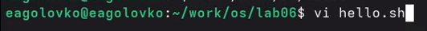
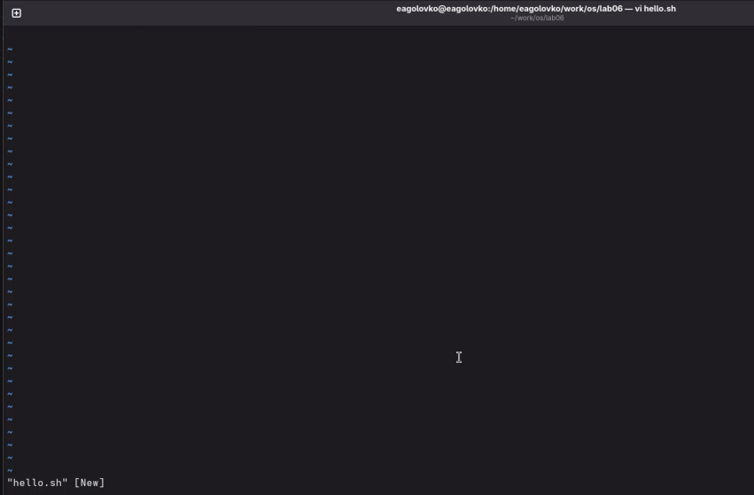
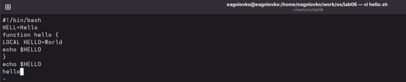
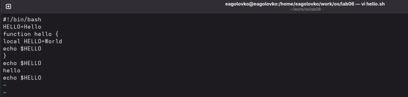
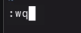

---
## Author
author:
  name: Головко Екатерина Андреевна
  degrees: DSc
  orcid: 0000-0002-0877-7063
  email: 1032252356@rudn.ru
  affiliation:
    - name: Российский университет дружбы народов
      country: Российская Федерация
      postal-code: 117198
      city: Москва
      address: ул. Миклухо-Маклая, д. 6

## Title
title: "Отчет по лабораторной работе №10"
subtitle: "Операционные системы"
license: "CC BY"
---

# Цель работы

Познакомиться с операционной системой Linux. Получить практические навыки работы с редактором vi, установленным по умолчанию практически во всех дистрибутивах.

# Задание

1. Создание нового файла с использованием vi

2. Редактирование существующего файла

# Теоретическое введение

В большинстве дистрибутивов Linux в качестве текстового редактора по умолчанию устанавливается интерактивный экранный редактор vi (Visual display editor).
Редактор vi имеет три режима работы:
– командный режим — предназначен для ввода команд редактирования и навигации по
редактируемому файлу;
– режим вставки — предназначен для ввода содержания редактируемого файла;
– режим последней (или командной) строки — используется для записи изменений в файл и выхода из редактора.
Для вызова редактора vi необходимо указать команду vi и имя редактируемого файла:
```vi <имя_файла>```
При этом в случае отсутствия файла с указанным именем будет создан такой файл.
Переход в командный режим осуществляется нажатием клавиши Esc. Для выхода из редактора vi необходимо перейти в режим последней строки: находясь в командном режиме, нажать Shift-; (по сути символ : — двоеточие), затем:
– набрать символы wq, если перед выходом из редактора требуется записать изменения в файл;
– набрать символ q (или q!), если требуется выйти из редактора без сохранения.

# Выполнение лабораторной работы

## Задание 1

Создаю нужный мне каталог и перехожу в него ([рис. @fig-001]).

{#fig-001 width=70%}

Создаю новый файл и открываю его с помощью редактора vi ([рис. @fig-002]).

{#fig-002 width=70%}

Открытое окно редактора ([рис. @fig-003]).

{#fig-003 width=70%}

Нажимаю клавишу i и ввожу текст, представленный на скриншоте([рис. @fig-004]).

{#fig-004 width=70%}

Ввожу : для перехода в режим последней строки и ввожу wq (w - записать, q - выйти), затем нажимаю enter ([рис. @fig-005]).

{#fig-005 width=70%}

Делаю файл исполняемым ([рис. @fig-006]).

{#fig-006 width=70%}

## Задание 2

Опять открываю файл hello.sh, редактирую его, используя горячие клавиши специальные для этого редактора, удаляю строку с помощью dd, отменяю изменения с помощью u ([рис. @fig-007]).

{#fig-007 width=70%}

Также сохраняю файл и выхожу из текстового редактора([рис. @fig-008]).

{#fig-008 width=70%}

# Выводы

В ходе данной лабораторной работы я приобрела практические навыки работы с редактором vi.
