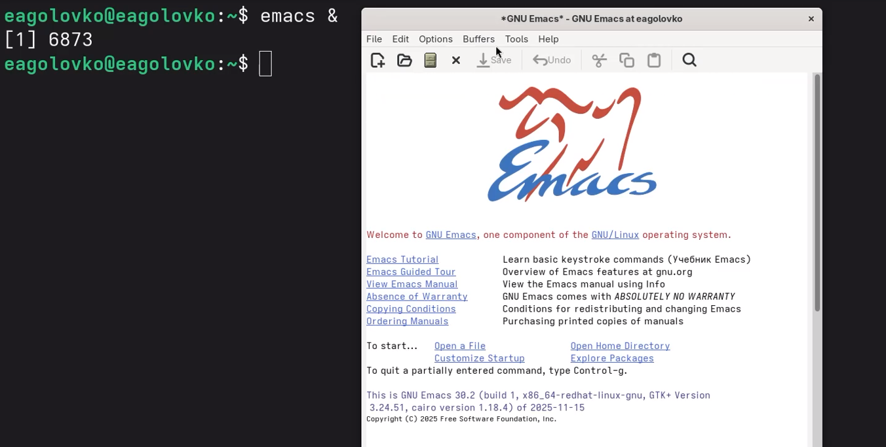
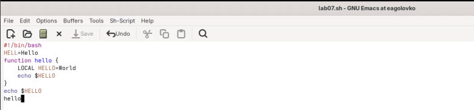

---
## Author
author:
  name: Головко Екатерина Андреевна
  degrees: DSc
  orcid: 0000-0002-0877-7063
  email: 1032252356@rudn.ru
  affiliation:
    - name: Российский университет дружбы народов
      country: Российская Федерация
      postal-code: 117198
      city: Москва
      address: ул. Миклухо-Маклая, д. 6
## Title
title: Лабораторная работа №11
subtitle: Операционные системы
license: CC BY
date: today
date-format: "YYYY-MM-DD" # Example: 2025-09-06
---

# Информация

## Докладчик

:::::::::::::: {.columns align=center}
::: {.column width="70%"}

  * Головко Екатерина Андреевна
  * студент ФФМиЕН НБИ
  * Российский университет дружбы народов им. П. Лумумбы
  * [1032252356@rudn.ru](mailto:1032252356@rudn.ru)
  * <https://eagolovko.github.io/>

:::
::: {.column width="30%"}

:::
::::::::::::::

## Цель работы

Получить практические навыки работы с редактором Emacs.

## Задание

1. Ознакомиться с редактором и выполнить упражнения по редактированию файла

# Выполнение лабораторной работы

## Выполнение лабораторной работы

Открываю редактор Emacs через терминал в фоновом режиме ([рис. @fig-001]).

## Выполнение лабораторной работы

{#fig-001 width=70%}

## Выполнение лабораторной работы

Создаю файл lab07.sh, используя комбинации клавиш ([рис. @fig-002]).

## Выполнение лабораторной работы

{#fig-002 width=70%}

## Выполнение лабораторной работы

Ввожу текст команды и тренируюсь в нем использовать комбинации клавиш, например: выделение области, вставка, копирование, работа с последней строкой, перемещением в начало и конец и с буфером обмена ([рис. @fig-003]).

{#fig-003 width=70%}

## Выполнение лабораторной работы

Также работаю с буфером обмена. Открываю 4 окна буфера и в каждом создаю новый ([рис. @fig-004]).

{#fig-004 width=70%}

## Выводы

В ходе данной лабораторной работы я приобрела практические навыки использования редактора Emacs.
