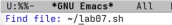
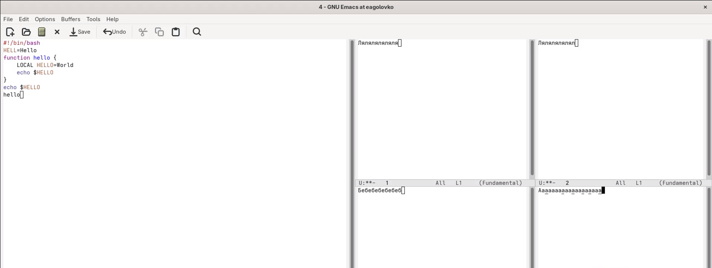

---
## Author
author:
  name: Головко Екатерина Андреевна
  degrees: DSc
  orcid: 0000-0002-0877-7063
  email: 1032252356@rudn.ru
  affiliation:
    - name: Российский университет дружбы народов
      country: Российская Федерация
      postal-code: 117198
      city: Москва
      address: ул. Миклухо-Маклая, д. 6

## Title
title: "Отчёт по лабораторной работе №11"
subtitle: "Операционные системы"
license: "CC BY"
---

# Цель работы

Получить практические навыки работы с редактором Emacs.

# Задание

1. Ознакомиться с редактором и выполнить упражнения по редактированию файла

# Теоретическое введение

**Определение 1.** Буфер — объект, представляющий какой-либо текст.

Буфер может содержать что угодно, например, результаты компиляции программы или встроенные подсказки. Практически всё взаимодействие с пользователем, в том числе интерактивное, происходит посредством буферов.

**Определение 2.** Фрейм соответствует окну в обычном понимании этого слова. Каждый фрейм содержит область вывода и одно или несколько окон Emacs.

**Определение 3.** Окно — прямоугольная область фрейма, отображающая один из буферов.

Каждое окно имеет свою строку состояния, в которой выводится следующая информация: название буфера, его основной режим, изменялся ли текст буфера и как далеко вниз по буферу расположен курсор. Каждый буфер находится только в одном из возможных основных режимов. Существующие основные режимы включают режим Fundamental (наименее специализированный), режим Text, режим Lisp, режим С, режим Texinfo и другие. Под второстепенными режимами понимается список режимов, которые включены в данный момент в буфере выбранного окна.

**Определение 4.** Область вывода — одна или несколько строк внизу фрейма, в которой Emacs выводит различные сообщения, а также запрашивает подтверждения и дополнительную информацию от пользователя.

**Определение 5.** Минибуфер используется для ввода дополнительной информации и всегда отображается в области вывода.

**Определение 6.** Точка вставки — место вставки (удаления) данных в буфере.

# Выполнение лабораторной работы

Открываю редактор Emacs через терминал в фоновом режиме ([рис. @fig-001]).

{#fig-001 width=70%}

Создаю файл lab07.sh, используя комбинации клавиш ([рис. @fig-002]).

{#fig-002 width=70%}

Ввожу текст команды и тренируюсь в нем использовать комбинации клавиш, например: выделение области, вставка, копирование, работа с последней строкой, перемещением в начало и конец и с буфером обмена ([рис. @fig-003]).

{#fig-003 width=70%}

Также работаю с буфером обмена. Открываю 4 окна буфера и в каждом создаю новый ([рис. @fig-004]).

{#fig-004 width=70%}

# Выводы

В ходе данной лабораторной работы я приобрела практические навыки использования редактора Emacs.

