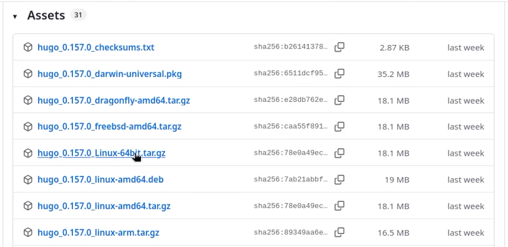
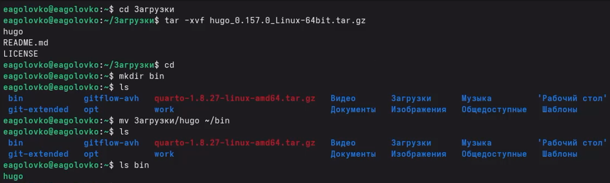
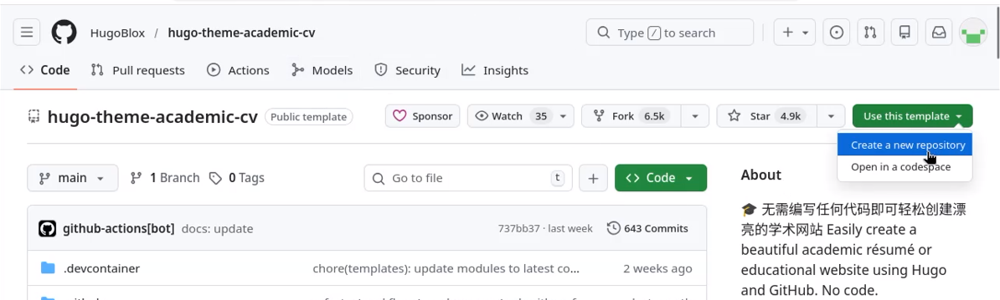
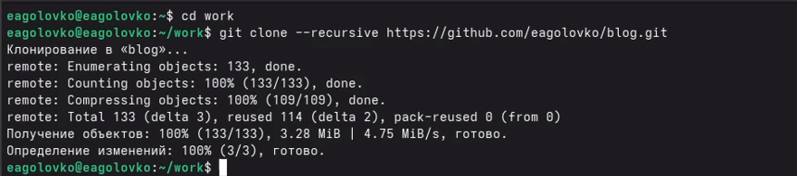
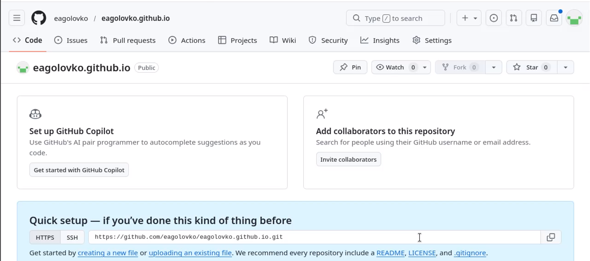
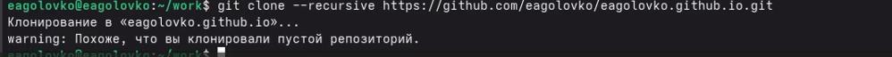
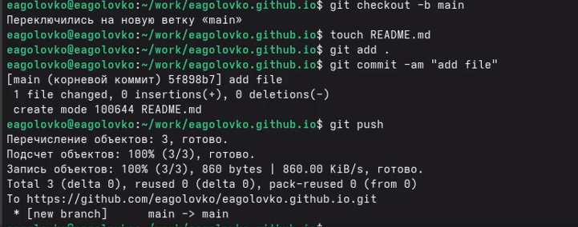
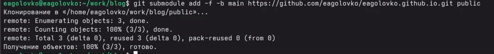
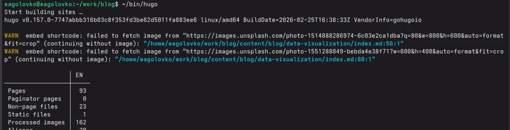
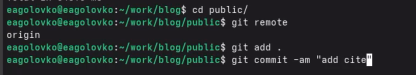

---
## Author
author:
  name: Головко Екатериан Андреевна
  degrees: DSc
  orcid: 0000-0002-0877-7063
  email: 1032252356@rudn.ru
  affiliation:
    - name: Российский университет дружбы народов
      country: Российская Федерация
      postal-code: 117198
      city: Москва
      address: ул. Миклухо-Маклая, д. 6
## Title
title: Первый этап индивидуального проекта
subtitle: Операционные системы
license: CC BY
date: today
date-format: "YYYY-MM-DD" # Example: 2025-09-06
---

# Информация

## Докладчик

:::::::::::::: {.columns align=center}
::: {.column width="70%"}

  * Головко Екатерина Андреевна
  * студент
  * студент ФФМиЕН НБИ
  * Российский университет дружбы народов им. П. Лумумбы
  * [1032252356@rudn.ru](mailto:1032252356@rudn.ru)

:::
::: {.column width="30%"}

:::
::::::::::::::

## Цель

Научиться размещать сайт на Github Pages. Выполнить первый этап индивидуального проекта.

## Задание

1. Установка необходимого ПО

2. Скачивание шаблона темы сайта

3. Размещение на хостинге Git

4. Установка параметра для URLs сайта

5. Размещение заготовки на Github Pages

# Выполнение лабораторной работы

##  Установка необходимого ПО

Скачиваю последнюю версию исполняемого файла hugo для своей операционной системы ([рис. @fig-001]).

{#fig-001 width=70%}

##  Установка необходимого ПО

Распаковываю архив исполняемого файла, создаю в домашнем каталоге папку bin и переношу в эту папку исполняемый файл ([рис. @fig-002]).

{#fig-002 width=70%}

## Скачивание шаблона темы сайта

Открываю репозиторий с шаблоном сайта и создаю свой репозиторий на основе репозитория с шаблоном сайта ([рис. @fig-003]).

{#fig-003 width=70%}

## Скачивание шаблона темы сайта

Клонирую созданный репозиторий к себе в локальный репозиторий ([рис. @fig-004]).

{#fig-004 width=70%}

## Размещение на хостинге Git

Запускаю исполняемый файл ([рис. @fig-005]).

{#fig-005 width=70%}

## Размещение на хостинге Git

Удаляю папку public, заново запускаю исполняемый файл и открываю локальный сайт ([рис. @fig-006]).

{#fig-006 width=70%}

## Установка параметра для URLs сайта

Создаю новый репозиторий с нужным названием ([рис. @fig-007]).

{#fig-007 width=70%}

## Установка параметра для URLs сайта

Клонирую созданный репозиторий чтобы создать локальный репозиторий у себя на компьютере ([рис. @fig-008]).

{#fig-008 width=70%}

## Установка параметра для URLs сайта

Создаю главную ветку main, создаю пустой файл и отправляю изменения на глобальный репозиторий чтобы его активировать ([рис. @fig-009]).

{#fig-009 width=70%}

## Установка параметра для URLs сайта

Подключаю репозиторий к каталогу public ([рис. @fig-010]).

{#fig-010 width=70%}

## Установка параметра для URLs сайта

Снова запускаю исполняемый файл ([рис. @fig-011]).

{#fig-011 width=70%}

## Размещение заготовки на Github Pages

Проверяю есть ли подключение между public и репозиторием, далее отправляю изменения на глобальный репозиторий ([рис. @fig-012]).

{#fig-012 width=70%}

## Размещение заготовки на Github Pages

После захожу в гитхаб, настройки, страницы, нахожу ссылку на свой сайт и запускаю его ([рис. @fig-013]).

{#fig-013 width=70%}

# Вывод

## Вывод

Я научилась размещать сайт на гитхаб и следовательно выполнила первый этап реализации проекта.

