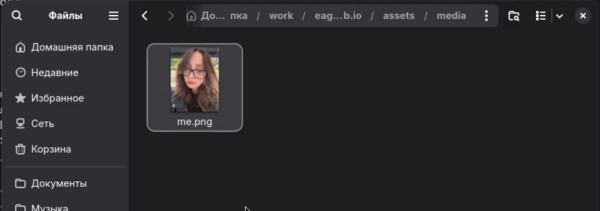

---
## Author
author:
  name: Головко Екатерина Андреевна
  degrees: DSc
  orcid: 0000-0002-0877-7063
  email: 1032252356@rudn.ru
  affiliation:
    - name: Российский университет дружбы народов
      country: Российская Федерация
      postal-code: 117198
      city: Москва
      address: ул. Миклухо-Маклая, д. 6

## Title
title: "отчет по этапу индивидуального проекта №2"
subtitle: "операционные системы"
license: "CC BY"
---

# Цель работы

Научиться изменять данные на сайте, созданного из шаблона. 

# Задание

1. Добавить информацию о себе
2. Изменить фотографию
3. Опубликовать посты

# Выполнение лабораторной работы

## Редактирование информации

Редактирую информацию (имя, фамилию, описание, образование, название сайта) в файлах проекта сайта в домашнем репозитории ([рис. @fig-001], [рис. @fig-002], [рис. @fig-003], [рис. @fig-004]).

{#fig-001 width=70%}

{#fig-002 width=70%}

{#fig-003 width=70%}

{#fig-004 width=70%}

## Редактирование фото

Редактирую фотографию добавляю свою в необходимый каталог ([рис. @fig-005]).

{#fig-005 width=70%}

## Публикация постов

Выкладываю посты, редактируя информацию в файлах домашнего репозитория ([рис. @fig-006], [рис. @fig-007]).

{#fig-006 width=70%}

{#fig-007 width=70%}

Выгружаю все изменения на гитхаб, жду пересборки сайта и запускаю его после выполненных коммитов ([рис. @fig-008], [рис. @fig-009]).

{#fig-008 width=70%}

{#fig-009 width=70%}

# Выводы

В ходе данной лабораторной работы я научилась редактировать информацию на сайте. 
