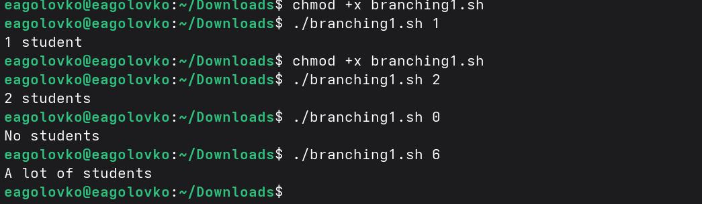

# Информация

## Докладчик

:::::::::::::: {.columns align=center}
::: {.column width="70%"}

  * Головко Екатерина Андреевна
  * студент НБИ
  * Российский университет дружбы народов им. П. Лумумбы
  * [1032252356@rudn.ru](mailto:1032252356@rudn.ru)
  * <https://eagolovko.github.io/>

:::
::: {.column width="30%"}

:::
::::::::::::::

## Цель работы

Освоить продвинутые навыки работы в Linux на курсе Stepik

## vim

- Что это?

## vim

## Скрипты на bash

- Изучение скриптов
- Как работает

## Скрипты на bash

## Скрипты на bash

## Продвинутый поиск и редактирование

- Работа с командами find и grep

## Выводы

В ходе данного раздела курса я освоила продвинутую работу с Linux.

